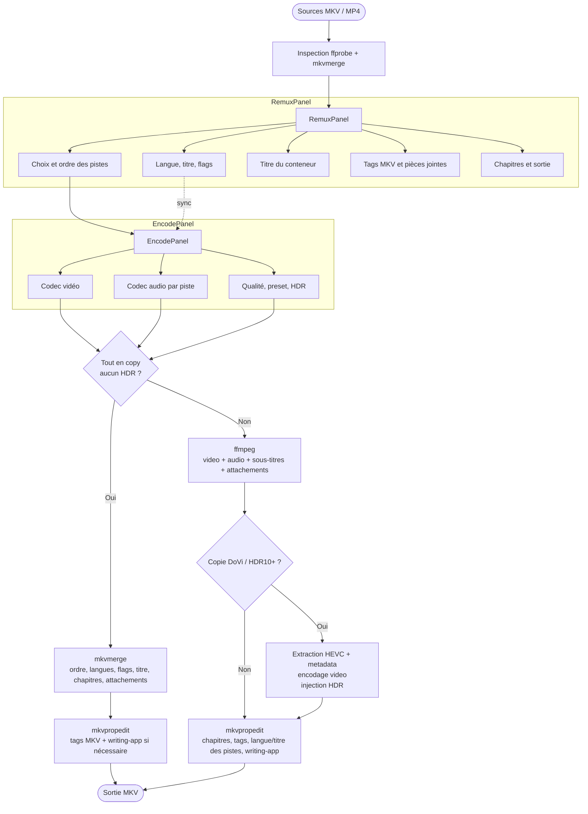
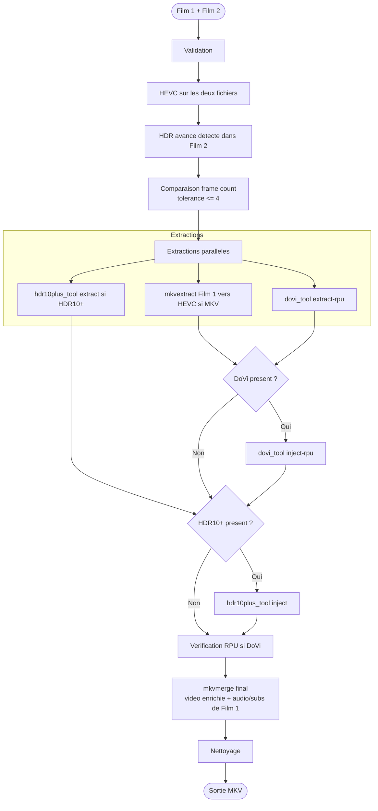
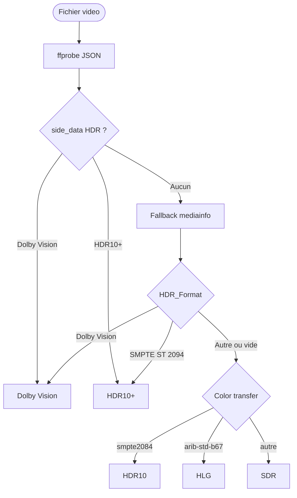

# 🎬 Mediarecode

Interface graphique pour préparer des fichiers vidéo, remuxer sans perte, réencoder avec `ffmpeg`, et fusionner des métadonnées Dolby Vision / HDR10+.

Cette documentation correspond à **Mediarecode v1.1**.

## Vue rapide

| Outil | Usage | Qualité |
|-------|-------|---------|
| **Conteneur & Encodage** | sélectionner les pistes, les réordonner, éditer langue/titre/flags, gérer titre/tags/chapitres/pièces jointes, puis copier ou réencoder | copie = sans perte, encodage = avec recompression |
| **Fusion DoVi / HDR10+** | injecter les métadonnées HDR d'un fichier source dans le flux vidéo HEVC d'un autre fichier | sans perte |

> Les panneaux **Remuxage** et **Encodage** forment un seul workflow. Le panneau Remuxage prépare le conteneur ; le panneau Encodage décide comment traiter la vidéo et l'audio.

## Installation

### Prérequis

- **Python 3.10+**

`setup.py` installe ensuite **tous les autres prérequis** pour **Windows**, **Linux Fedora / RHEL**, **Linux Debian / Ubuntu** et **macOS**, y compris **PySide6** et les outils externes nécessaires.

### Cloner le dépôt

```bash
git clone <url-du-depot>
cd mediarecode
```

### Installer les dépendances et les outils

Le script `setup.py` installe automatiquement :

| Catégorie | Installé par `setup.py` |
|-----------|-------------------------|
| Dépendance Python | `PySide6` |
| Outils système | `ffmpeg`, `ffprobe`, `mkvmerge`, `mkvextract`, `mkvinfo`, `mkvpropedit`, `mediainfo` |
| Outils GitHub | `dovi_tool`, `hdr10plus_tool` |
| Notes plateforme | Debian/Ubuntu via `apt`, Fedora/RHEL via `dnf`, macOS via Homebrew, Windows via `winget` + binaires locaux |

> Sous Windows, `setup.py` renseigne aussi `config.ini` avec les chemins détectés. Sur toutes les plateformes, vous pouvez garder cette configuration auto ou définir vos propres chemins d'outils dans `config.ini`.

| Plateforme | Commande | Détails |
|------------|----------|---------|
| Linux Debian / Ubuntu | `python3 setup.py` | installe `ffmpeg`, `mkvtoolnix`, `mediainfo` via `apt`, puis `dovi_tool` et `hdr10plus_tool` depuis GitHub |
| Linux Fedora / RHEL | `python3 setup.py` | active RPM Fusion si nécessaire, installe `ffmpeg`, `mkvtoolnix`, `mediainfo` via `dnf`, puis les outils GitHub |
| macOS | `python3 setup.py` | installe `ffmpeg`, `mkvtoolnix`, `mediainfo` via Homebrew, puis `dovi_tool` et `hdr10plus_tool` |
| Windows | `py setup.py` | installe `ffmpeg`, `mkvtoolnix` et `mediainfo` via `winget`, place `dovi_tool` et `hdr10plus_tool` dans `mediarecode\\tools`, puis renseigne `config.ini` avec les chemins détectés |

Options utiles du script :

| Option | Effet |
|--------|-------|
| `--dry-run` | affiche les actions sans les exécuter |
| `--no-github` | n'installe pas `dovi_tool` ni `hdr10plus_tool` |
| `--prefix PATH` | change le dossier d'installation des binaires GitHub |
| `--force` | relance les installations et régénère les chemins Windows dans `config.ini` |

`eac3to` est optionnel et non installable automatiquement. Il reste utile sous Windows pour certains traitements audio avancés.

### Lancer l'application

```bash
python3 main.py
```

Sous Windows, utilisez `py main.py`.

## Interface et usage

### Tableau de bord

Le tableau de bord affiche :

- l'état des outils externes détectés
- les dossiers configurés (travail, sortie, app data)
- les encodeurs logiciels vus par `ffmpeg -encoders`
- les encodeurs matériels réellement testés au runtime (`NVENC`, `AMF`, `VAAPI`, `QSV`)

> Les encodeurs matériels ne sont pas marqués disponibles simplement parce qu'ils apparaissent dans `ffmpeg`. L'application lance un probe réel pour confirmer qu'ils fonctionnent.

### Conteneur & Encodage

Le workflow unifié permet de :

- ajouter une ou plusieurs sources MKV / MP4
- inspecter vidéo, audio, sous-titres, chapitres, pièces jointes et tags MKV
- activer, exclure et réordonner les pistes
- éditer langue, titre et flags de chaque piste
- définir le titre du conteneur, les balises globales, les chapitres et les pièces jointes
- choisir pour chaque piste audio un mode `copy`, `aac`, `eac3` ou `flac`
- choisir pour la vidéo `copy`, `libx265`, `libx264`, `libsvtav1`, `NVENC`, `AMF`, `VAAPI` ou `QSV`

Modes d'exécution :

| Condition | Mode | Outils utilisés |
|-----------|------|-----------------|
| vidéo en `copy`, audio en `copy`, aucune transformation HDR | **Remuxage pur** | `mkvmerge`, puis `mkvpropedit` pour les tags MKV / writing-app si nécessaire |
| tout autre cas | **Encodage** | `ffmpeg`, puis `mkvpropedit` pour chapitres personnalisés, tags MKV et métadonnées de pistes |

Les options HDR disponibles côté encodage sont :

- injection de métadonnées HDR10 statiques
- tone mapping HDR vers SDR
- copie DoVi / HDR10+ depuis la source avec workflow multi-étapes

### Fusion DoVi / HDR10+

Ce panneau prend :

- **Film 1** : la vidéo cible à enrichir (`.mkv` ou `.hevc`)
- **Film 2** : la source HDR contenant Dolby Vision et/ou HDR10+ (`.mkv` ou `.hevc`)

Règles importantes :

- Film 1 et Film 2 doivent contenir de la **vidéo HEVC**
- Film 2 doit contenir **Dolby Vision** et/ou **HDR10+**
- l'écart de frame count doit être **<= 4 images**
- le remux final conserve l'audio et les sous-titres de Film 1

Profils Dolby Vision proposés :

| Profil | Effet |
|--------|-------|
| **Profile 8.1** | normalise l'injection en profil 8.1, recommandé pour les remux UHD |
| **Mode 0** | conserve le profil source sans réécriture |

## Configuration

### Priorité des réglages

L'application résout ses paramètres dans cet ordre :

1. `config.ini` à la racine du projet
2. les valeurs persistées par l'interface (`QSettings`)
3. les valeurs par défaut internes

Sous Windows, `setup.py` et le démarrage de l'application peuvent auto-détecter les outils et renseigner automatiquement la section `[tools]` de `config.ini`.

### Paramètres principaux

| Paramètre | Défaut | Description |
|-----------|--------|-------------|
| `work_dir` | `/tmp/mediarecode_work` sur Linux/macOS, `%TEMP%\\mediarecode_work` sur Windows | dossier des fichiers temporaires |
| `output_dir` | dossier Vidéos de l'OS | dossier de sortie par défaut |
| `ram_buffer_enabled` | `true` | autorise l'usage de `/dev/shm` pour les HEVC intermédiaires si disponible |
| `ram_buffer_threshold_pct` | `15` | pourcentage minimal de RAM libre à conserver pour activer ce buffer |

### Outils configurables

Vous pouvez définir explicitement dans `config.ini` :

- `ffmpeg`, `ffprobe`
- `mkvmerge`, `mkvextract`, `mkvinfo`, `mkvpropedit`
- `mediainfo`
- `dovi_tool`, `hdr10plus_tool`
- `eac3to`

Exemple :

```ini
[paths]
output_dir = /mnt/nas/videos

[tools]
ffmpeg = /opt/ffmpeg/bin/ffmpeg
mkvpropedit = /usr/bin/mkvpropedit
dovi_tool = /usr/local/bin/dovi_tool
```

## Workflows

### Conteneur & Encodage



### Fusion DoVi / HDR10+



### Détection HDR d'un fichier



## Outils externes

| Outil | Rôle principal |
|-------|----------------|
| `ffprobe` | analyse des flux, chapitres et métadonnées |
| `mediainfo` | frame count et informations HDR fines |
| `ffmpeg` | encodage, copie de flux, reconstruction finale |
| `mkvmerge` | remuxage pur et remuxage final de la fusion HDR |
| `mkvextract` | extraction du flux HEVC depuis un MKV |
| `mkvpropedit` | chapitres, tags MKV, langues/titres de pistes, writing-app |
| `dovi_tool` | extraction, injection et vérification Dolby Vision |
| `hdr10plus_tool` | extraction et injection HDR10+ |
| `nvidia-smi` | fallback de détection NVENC sous Linux |

---

*Mediarecode v1.1*
