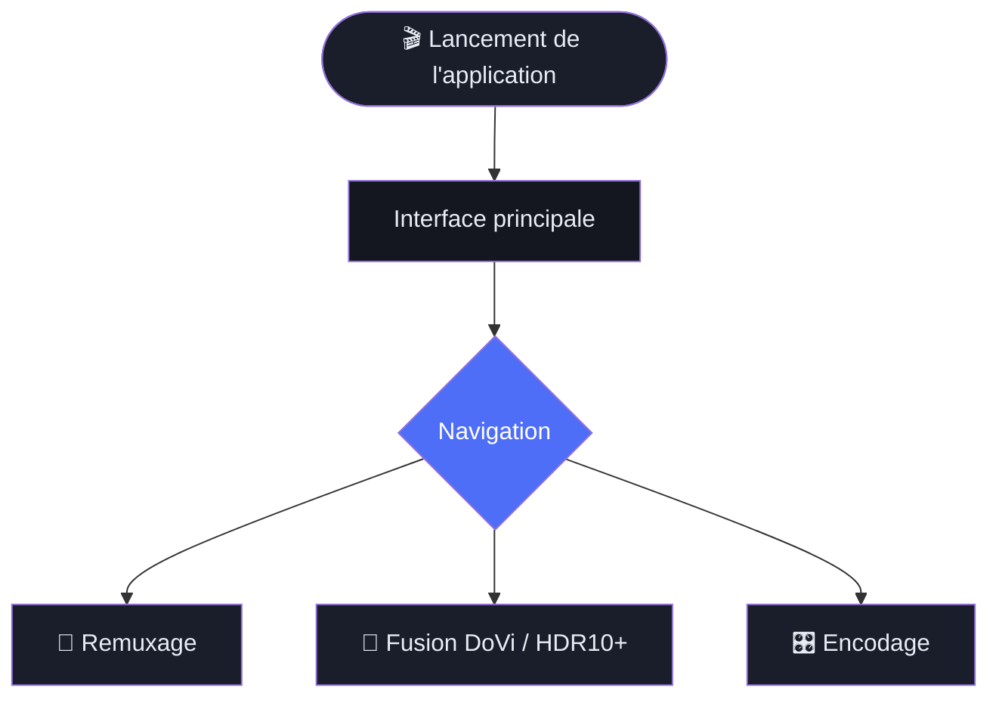
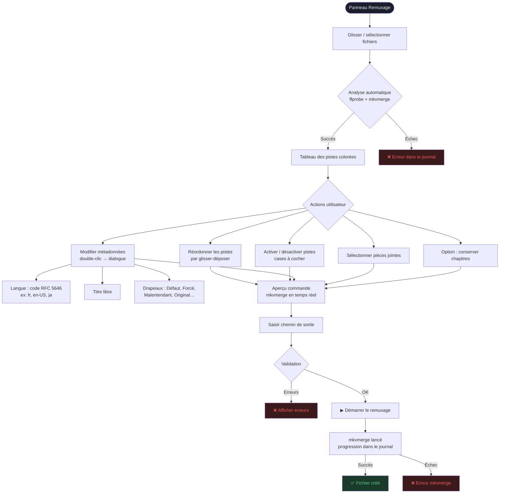
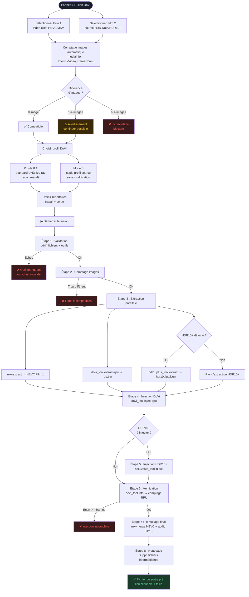
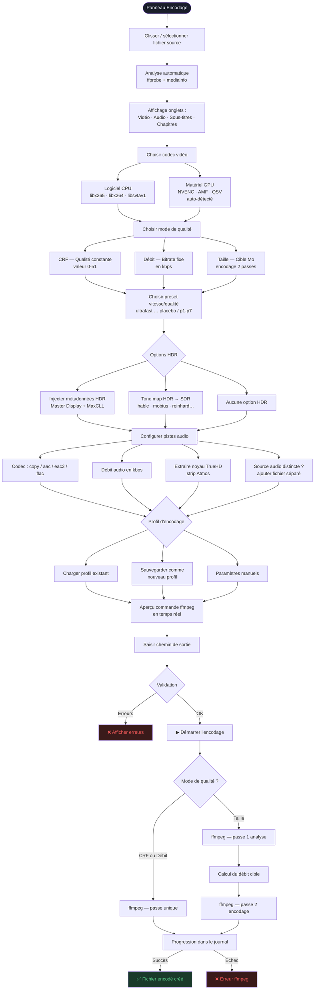
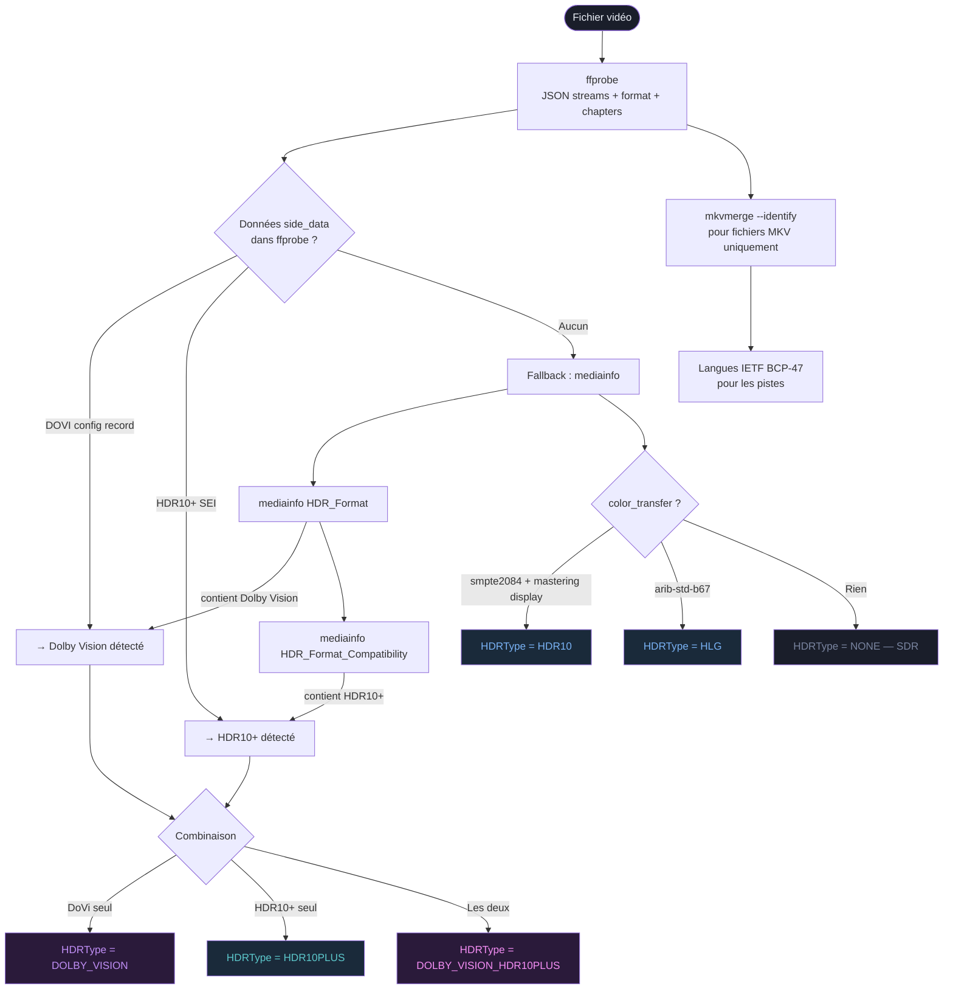

# 🎬 MKV/MP4 Toolkit

Interface graphique pour le traitement avancé de fichiers vidéo MKV et MP4 — remuxage, injection de métadonnées HDR Dolby Vision / HDR10+, et encodage vidéo.

---

## 📋 Table des matières

- [À quoi ça sert ?](#-à-quoi-ça-sert-)
- [Prérequis](#-prérequis)
- [Lancement](#-lancement)
- [Interface générale](#-interface-générale)
- [Fonctionnalité 1 — Remuxage](#-fonctionnalité-1--remuxage)
- [Fonctionnalité 2 — Fusion Dolby Vision / HDR10+](#-fonctionnalité-2--fusion-dolby-vision--hdr10)
- [Fonctionnalité 3 — Encodage vidéo](#-fonctionnalité-3--encodage-vidéo)
- [Paramètres et configuration](#️-paramètres-et-configuration)
- [Schéma des workflows](#-schéma-des-workflows)

---

## 🤔 À quoi ça sert ?

Ce logiciel s'adresse aux personnes qui travaillent avec des fichiers vidéo haute qualité (films UHD 4K, Blu-ray numérisés, etc.) et qui ont besoin d'effectuer des opérations précises sans dégrader la qualité d'image.

### Trois opérations principales

| Opération | Description | Perd de la qualité ? |
|-----------|-------------|----------------------|
| **Remuxage** | Réorganiser, sélectionner ou renommer des pistes (vidéo, audio, sous-titres) dans un fichier MKV | ❌ Non |
| **Fusion HDR** | Injecter les métadonnées Dolby Vision et/ou HDR10+ d'un fichier source dans un autre fichier | ❌ Non |
| **Encodage** | Recompresser la vidéo avec un codec au choix (x265, AV1, NVENC…) | ⚠️ Oui (par définition) |

### Glossaire rapide pour débutant

| Terme | Explication simple |
|-------|--------------------|
| **MKV** | Format de conteneur vidéo (comme une boîte qui contient vidéo + audio + sous-titres) |
| **Remuxage** | Changer le contenu de la boîte sans retoucher la vidéo elle-même |
| **Piste** | Un flux dans le fichier : une piste vidéo, une piste audio, une piste de sous-titres |
| **HDR** | High Dynamic Range — image avec plus de luminosité et de couleurs qu'un écran standard |
| **Dolby Vision** | Format HDR propriétaire avec métadonnées dynamiques par image |
| **HDR10+** | Format HDR ouvert avec métadonnées dynamiques (Samsung, Amazon) |
| **RPU** | Les données Dolby Vision en binaire, séparées de la vidéo elle-même |
| **CRF** | Constante de qualité pour l'encodage : plus c'est bas, meilleure est la qualité |
| **Codec** | L'algorithme de compression vidéo : H.264, H.265 (HEVC), AV1… |

---

## 📦 Prérequis

### Dépendances Python

- Python 3.10+
- PySide6

```bash
pip install PySide6
```

### Outils externes requis

Ces programmes doivent être installés et accessibles dans le `PATH` :

| Outil | Rôle | Requis pour |
|-------|------|-------------|
| `ffmpeg` | Encodage vidéo et audio | Encodage |
| `ffprobe` | Analyse des fichiers vidéo | Toutes les fonctions |
| `mkvmerge` | Remuxage MKV | Remuxage, Fusion HDR |
| `mkvextract` | Extraction de pistes | Fusion HDR |
| `mkvinfo` | Informations MKV | Analyse |
| `mediainfo` | Métadonnées et comptage d'images | Fusion HDR, Analyse |
| `dovi_tool` | Extraction / injection RPU Dolby Vision | Fusion HDR (DoVi) |
| `hdr10plus_tool` | Extraction / injection HDR10+ | Fusion HDR (HDR10+) |

> **Note** : Les chemins vers ces outils sont configurables dans les paramètres si ils ne sont pas dans le PATH système.

---

## 🚀 Lancement

```bash
cd mediarecode
python mkv_toolkit/main.py
```

---

## 🖥️ Interface générale

L'interface est divisée en trois zones :

```
┌──────────┬──────────────────────────────────────────┐
│          │                                          │
│  Barre   │         Zone principale                  │
│  de      │   (change selon l'onglet sélectionné)    │
│  naviga- │                                          │
│  tion    │                                          │
│          │                                          │
├──────────┴──────────────────────────────────────────┤
│              Journal de log (pliable)               │
└─────────────────────────────────────────────────────┘
```

### Barre de navigation (gauche)

| Bouton | Page |
|--------|------|
| Tableau de bord | Page d'accueil |
| Fusion DoVi | Injection Dolby Vision / HDR10+ |
| Encodage | Encodage vidéo |
| Remuxage | Réorganisation de pistes |
| Paramètres | Configuration des outils et chemins |

### Journal de log (bas)

Le journal affiche en temps réel toutes les commandes et leur progression. Les messages sont colorés :

- 🔵 `INFO` — Information normale
- 🟢 `OK` — Succès
- 🟡 `WARN` — Avertissement
- 🔴 `ERROR` — Erreur

Le journal est pliable (cliquer sur l'en-tête). Sa hauteur maximale est configurable.

---

## 🔀 Fonctionnalité 1 — Remuxage

### Qu'est-ce que le remuxage ?

Le remuxage consiste à **réorganiser le contenu d'un fichier MKV sans réencoder**. Cela permet de :

- Supprimer des pistes inutiles (audio en langue indésirable, sous-titres superflus)
- Changer l'ordre des pistes
- Renommer des pistes (langue, titre)
- Modifier les drapeaux des pistes (défaut, forcé, malentendant…)
- Fusionner des pistes venant de plusieurs fichiers

L'opération est **instantanée et sans perte de qualité**.

### Étape par étape

#### 1. Ajouter des fichiers sources

Glisser-déposer un ou plusieurs fichiers MKV/MP4 dans la zone de liste des fichiers.
Chaque fichier est analysé automatiquement. Une couleur unique est attribuée à chaque source.

> 💡 Vous pouvez ajouter plusieurs sources pour fusionner des pistes de fichiers différents (ex : vidéo d'un fichier, audio d'un autre).

#### 2. Inspecter un fichier (optionnel)

Cliquer sur le bouton **Inspecter** à côté d'un fichier pour voir le détail de ses pistes :
- Onglet **Vidéo** : codec, résolution, fréquence d'images, profondeur, type HDR
- Onglet **Audio** : codec, canaux, débit, indicateurs Atmos/DTS:X
- Onglet **Sous-titres** : codec, langue, drapeaux forcé/défaut
- Onglet **Chapitres** : liste des chapitres

#### 3. Sélectionner les pistes

Le tableau des pistes liste toutes les pistes de tous les fichiers.
Les colonnes sont :

| Colonne | Description |
|---------|-------------|
| Type | V (vidéo), A (audio), S (sous-titres) |
| Codec | Le codec de la piste |
| Info | Résolution + HDR, canaux + débit selon le type |
| Langue | Code BCP-47 (ex : `fr`, `en-US`) |
| Titre | Nom de la piste |
| Activée | Case à cocher pour inclure/exclure la piste |

**Réordonner** : glisser-déposer les lignes pour changer l'ordre.
**Exclure** : décocher la case "Activée".

#### 4. Modifier les métadonnées d'une piste

Double-cliquer sur une ligne (ou menu contextuel) ouvre un dialogue d'édition :

- **Langue** : code RFC 5646 (ex : `fr`, `en`, `ja`, `zh-Hans`) — validé en temps réel
- **Titre** : nom libre
- **Drapeaux** :
  - `Défaut` : cette piste est sélectionnée par défaut
  - `Forcé` : sous-titres forcés (s'affiche toujours)
  - `Malentendant` : contient descriptions pour malentendants
  - `Déficient visuel` : contient descriptions audio
  - `Original` : langue originale du contenu
  - `Commentaire` : piste de commentaire audio

#### 5. Options globales

- **Conserver les chapitres** : inclure ou non les chapitres du premier fichier source
- **Sélectionner les pièces jointes** : si le fichier contient des attachements (ex : couverture), choisir lesquels inclure

#### 6. Choisir le fichier de sortie

Saisir ou sélectionner le chemin du fichier MKV de sortie.

#### 7. Vérifier l'aperçu de commande

La commande `mkvmerge` complète est affichée en temps réel. Elle se met à jour à chaque modification.

#### 8. Lancer le remuxage

Cliquer sur **Démarrer le remuxage**. La progression s'affiche dans le journal.

### Commande lancée

```bash
mkvmerge -o SORTIE.mkv
  [--track-order 0:1,0:2,1:0]
  [--video-tracks 1]
  [--audio-tracks 2,3]
  [--no-subtitles]
  [--no-chapters]
  [--track-name 2:Français]
  [--language-ietf 2:fr]
  [--default-track-flag 2:1]
  [--forced-track 3:0]
  SOURCE1.mkv
  SOURCE2.mkv
```

---

## 💫 Fonctionnalité 2 — Fusion Dolby Vision / HDR10+

### Qu'est-ce que c'est ?

Certaines sources vidéo contiennent le contenu HDR (Dolby Vision, HDR10+) dans un fichier, et la vidéo de meilleure qualité dans un autre. Cette fonctionnalité permet d'**injecter les métadonnées HDR du Film 2 dans le flux vidéo HEVC du Film 1**, sans réencodage.

**Exemple d'usage :** Un encode x265 excellent (Film 1) auquel vous voulez ajouter les couches Dolby Vision venant d'un Blu-ray (Film 2).

### Concepts clés

| Terme | Explication |
|-------|-------------|
| **Film 1** | Le fichier cible — contient la vidéo HEVC à enrichir |
| **Film 2** | La source HDR — contient le RPU Dolby Vision et/ou les métadonnées HDR10+ |
| **RPU** | Rpu = "Reference Processing Unit" — les données DoVi par image |
| **Profil 8.1** | Format DoVi standard pour UHD Blu-ray (recommandé) |
| **Mode 0** | Copie à l'identique du profil source sans modification |

### Prérequis

- Film 1 et Film 2 doivent avoir **le même nombre d'images** (tolérance : 4 images max)
- Film 2 doit contenir du Dolby Vision et/ou HDR10+
- Le flux vidéo doit être en **HEVC (H.265)**

### Étape par étape

#### 1. Sélectionner Film 1

Glisser-déposer ou sélectionner le fichier MKV cible (celui qui recevra les données HDR).

#### 2. Sélectionner Film 2

Glisser-déposer ou sélectionner le fichier source HDR (MKV ou HEVC brut).

#### 3. Vérification du nombre d'images

L'outil compare automatiquement le nombre d'images des deux fichiers :

- ✅ **Identique** : compatible
- ⚠️ **Différence ≤ 4** : avertissement mais on peut continuer
- ❌ **Différence > 4** : incompatible, opération bloquée

#### 4. Choisir le profil Dolby Vision

| Profil | Nom | Usage |
|--------|-----|-------|
| **Profile 8.1** | Standard UHD Blu-ray | Compatible avec tous les TV et lecteurs DoVi |
| **Mode 0** | Non modifié | Conserve le profil d'origine exact |

> Pour la majorité des usages, choisir **Profile 8.1**.

#### 5. Définir les répertoires

- **Répertoire de travail** : stockage des fichiers intermédiaires (peuvent être volumineux)
- **Répertoire de sortie** : emplacement du fichier final

#### 6. Lancer la fusion

Cliquer sur **Démarrer la fusion**. L'opération se déroule en **8 étapes** affichées dans l'interface :

| Étape | Description |
|-------|-------------|
| 1. Validation | Vérifie les fichiers, outils disponibles, présence HEVC et HDR |
| 2. Comptage d'images | Compare les durées exactes des deux films |
| 3. Extraction parallèle | Extrait simultanément le HEVC du Film 1, le RPU et les données HDR10+ du Film 2 |
| 4. Injection DoVi | Injecte le RPU dans le flux HEVC |
| 5. Injection HDR10+ | Injecte les métadonnées HDR10+ (si présentes) |
| 6. Vérification | Contrôle que le RPU injecté correspond au nombre d'images |
| 7. Remuxage | Assemble le HEVC enrichi avec l'audio et les sous-titres du Film 1 |
| 8. Nettoyage | Supprime les fichiers intermédiaires |

Chaque étape affiche sa durée. En cas d'erreur, l'étape concernée est indiquée avec le message d'erreur.

#### 7. Résultat

En cas de succès, l'interface affiche :
- ✅ Message de réussite
- 📁 Taille du fichier final
- Lien cliquable vers le fichier de sortie

### Commandes lancées (séquence complète)

```bash
# Comptage d'images
mediainfo --Inform=Video;%FrameCount% FILM1.mkv
mediainfo --Inform=Video;%FrameCount% FILM2.mkv

# Extraction parallèle
mkvextract FILM1.mkv tracks 0:film1.hevc
dovi_tool extract-rpu -i FILM2.mkv -o rpu.bin
hdr10plus_tool extract FILM2.mkv -o hdr10plus.json

# Injection
dovi_tool -m 2 inject-rpu -i film1.hevc -r rpu.bin -o film1_dovi.hevc
hdr10plus_tool inject -i film1_dovi.hevc -j hdr10plus.json -o film1_final.hevc

# Vérification
dovi_tool info -i film1_final.hevc

# Remuxage final
mkvmerge -o SORTIE.mkv --no-video FILM1.mkv film1_final.hevc --track-order ...
```

---

## 🎛️ Fonctionnalité 3 — Encodage vidéo

### Qu'est-ce que l'encodage ?

L'encodage consiste à **recompresser la vidéo** avec un nouveau codec. Contrairement au remuxage, l'image est recalculée — cela prend du temps et implique une légère perte de qualité, mais permet de réduire significativement la taille du fichier.

### Étape par étape

#### 1. Sélectionner la source vidéo

Glisser-déposer le fichier source. L'analyse s'effectue automatiquement et affiche :
- Format, durée, taille
- Toutes les pistes vidéo, audio, sous-titres et chapitres (en onglets)

#### 2. Choisir le codec vidéo

##### Codecs logiciels (CPU)

| Codec | Description | Usage recommandé |
|-------|-------------|-----------------|
| `libx265` | x265 — HEVC | Meilleure compression, standard actuel |
| `libx264` | x264 — H.264 | Compatibilité maximale |
| `libsvtav1` | SVT-AV1 | Compression excellente, plus lent |

##### Codecs matériels (GPU) — détectés automatiquement

| Codec | Description |
|-------|-------------|
| `hevc_nvenc` | HEVC via GPU NVIDIA |
| `hevc_amf` | HEVC via GPU AMD |
| `hevc_qsv` | HEVC via GPU Intel |
| `h264_nvenc` | H.264 via GPU NVIDIA |
| `h264_amf` | H.264 via GPU AMD |
| `h264_qsv` | H.264 via GPU Intel |

> Les codecs matériels sont beaucoup plus rapides mais la qualité est légèrement inférieure à iso-paramètres.

#### 3. Choisir le mode de qualité

| Mode | Description | Quand l'utiliser |
|------|-------------|-----------------|
| **CRF** — Qualité constante | Valeur de 0 (parfait) à 51 (médiocre). La taille varie. | Usage standard recommandé |
| **Débit** — Bitrate fixe | Débit cible en kbps. La qualité varie. | Streaming, contrainte de débit |
| **Taille** — Taille cible | Taille finale souhaitée en Mo. Encodage en 2 passes. | Contrainte de stockage précise |

> **Pour x265**, un CRF de 18-22 est généralement un bon équilibre qualité/taille.
> **Pour AV1**, un CRF de 28-35 est comparable.

#### 4. Choisir le preset

Le preset contrôle la **vitesse d'encodage vs qualité** :

- **Pour x265/x264** : de `ultrafast` (rapide, moins bon) à `placebo` (très lent, meilleur)
- **Pour SVT-AV1** : de `0` (qualité max) à `12` (vitesse max)
- **Pour NVENC** : de `p1` (rapide) à `p7` (lent)

> `medium` ou `slow` sont de bons choix pour x265.

#### 5. Options HDR

##### Injecter des métadonnées HDR statiques

Cocher **Injecter métadonnées HDR** pour préserver ou ajouter les données HDR10 :
- **Master Display** : format `G(x,y)B(x,y)R(x,y)WP(x,y)L(max,min)` — données de calibration de l'écran maître
- **MaxCLL** : format `max,fall` — luminosité maximale et moyenne des images

##### Tone mapping HDR → SDR

Cocher **Tone map HDR → SDR** pour convertir une source HDR en SDR compatible avec des écrans standards. Algorithmes disponibles :

| Algorithme | Résultat |
|------------|----------|
| `hable` | Filmique, préserve les hautes lumières |
| `mobius` | Transition douce entre SDR et HDR |
| `reinhard` | Simple, peut écraser les hautes lumières |
| `gamma` | Gamma simple |
| `linear` | Linéaire pur |
| `clip` | Écrêtage direct |

> `hable` et `mobius` sont généralement les plus agréables visuellement.

#### 6. Configurer les pistes audio

Pour chaque piste audio à inclure dans le fichier de sortie :

| Option | Description |
|--------|-------------|
| **Codec** | `copy` (sans ré-encodage), `aac`, `eac3`, `flac` |
| **Débit** | En kbps (pour aac et eac3) |
| **Extraire noyau TrueHD** | Strip les données Atmos pour garder uniquement le TrueHD de base |

**Ajouter une piste audio** : le bouton "+" permet de sélectionner une piste audio depuis le fichier source ou depuis un autre fichier.

#### 7. Gérer les profils d'encodage

Les paramètres peuvent être sauvegardés en tant que profil réutilisable :
- **Charger** : sélectionner un profil existant dans la liste
- **Sauvegarder** : donner un nom au profil pour l'utiliser plus tard
- **Supprimer** : retirer un profil personnalisé

#### 8. Vérifier l'aperçu de commande

La commande `ffmpeg` complète est affichée. Pour le mode Taille (2 passes), seule la passe 1 est prévisualisée.

#### 9. Lancer l'encodage

Cliquer sur **Démarrer l'encodage**. La progression s'affiche dans le journal.

### Commandes lancées

#### Encodage simple (modes CRF ou Débit)

```bash
ffmpeg -hide_banner -y \
  -i SOURCE.mkv \
  -map 0:v:0 \
  -c:v libx265 -crf 20 -preset slow \
  -x265-params "master-display=G(13250,34500)B(7500,3000)R(34000,16000)WP(15635,16450)L(10000000,1):max-cll=1000,400" \
  -color_primaries bt2020 -color_trc smpte2084 -colorspace bt2020nc \
  -map 0:a:0 \
  -c:a:0 copy \
  SORTIE.mkv
```

#### Encodage 2 passes (mode Taille)

```bash
# Passe 1 — analyse
ffmpeg ... -pass 1 -an -f null /dev/null

# Passe 2 — encodage final
ffmpeg ... -pass 2 ... SORTIE.mkv
```

#### Tone mapping HDR → SDR

```bash
ffmpeg -i SOURCE.mkv \
  -vf "zscale=transfer=linear:npl=100,format=gbrpf32le,zscale=primaries=bt709,\
       tonemap=tonemap=hable:desat=0,zscale=transfer=bt709:matrix=bt709:range=tv,format=yuv420p" \
  ...
```

---

## ⚙️ Paramètres et configuration

### Chemins configurables

| Paramètre | Défaut | Description |
|-----------|--------|-------------|
| `work_dir` | `/tmp/mkv_toolkit_work` | Répertoire pour les fichiers intermédiaires |
| `output_dir` | `~/Videos` | Répertoire de sortie par défaut |

### Chemins des outils

Si les outils ne sont pas dans le PATH, il est possible de spécifier leur chemin complet :

| Paramètre | Outil |
|-----------|-------|
| `tool_ffmpeg` | ffmpeg |
| `tool_ffprobe` | ffprobe |
| `tool_mkvmerge` | mkvmerge |
| `tool_mkvextract` | mkvextract |
| `tool_mkvinfo` | mkvinfo |
| `tool_mediainfo` | mediainfo |
| `tool_dovi_tool` | dovi_tool |
| `tool_hdr10plus` | hdr10plus_tool |

### Buffer RAM (Linux)

| Paramètre | Défaut | Description |
|-----------|--------|-------------|
| `ram_buffer_enabled` | `true` | Utiliser `/dev/shm` pour les fichiers HEVC intermédiaires |
| `ram_buffer_threshold_pct` | `15` | Pourcentage de RAM libre minimum requis (15% = ne pas utiliser si moins de 15% de RAM libre) |

### Variables d'environnement

Toutes les options peuvent être surchargées via des variables d'environnement (priorité maximale) :

```bash
export TOOL_FFMPEG=/opt/ffmpeg/bin/ffmpeg
export TOOL_DOVI_TOOL=/usr/local/bin/dovi_tool
export OUTPUT_DIR=/mnt/nas/videos
export RAM_BUFFER_ENABLED=false
python mkv_toolkit/main.py
```

---

## 📊 Schéma des workflows

### Vue d'ensemble



---

### Workflow Remuxage



---

### Workflow Fusion Dolby Vision / HDR10+



---

### Workflow Encodage



---

### Analyse d'un fichier (détection HDR)



---

## 🔧 Résumé des outils et usages

| Outil | Utilisé pour | Opération |
|-------|-------------|-----------|
| **ffprobe** | Analyse tous fichiers | Lecture streams, format, chapitres, HDR side_data |
| **mediainfo** | Comptage images, HDR précis | FrameCount, HDR_Format, HDR_Format_Compatibility |
| **mkvmerge** | Remuxage, remuxage final DoVi | Assemblage pistes sans réencodage |
| **mkvextract** | Fusion DoVi | Extraction flux HEVC d'un MKV |
| **dovi_tool** | Fusion DoVi | Extraction RPU, injection RPU, vérification |
| **hdr10plus_tool** | Fusion DoVi (HDR10+) | Extraction JSON HDR10+, injection |
| **ffmpeg** | Encodage, tone mapping | Encodage vidéo/audio, filtres |
| **nvidia-smi** | Détection GPU | Présence NVIDIA (fallback pour NVENC) |

---

*MKV/MP4 Toolkit v0.1.0*
