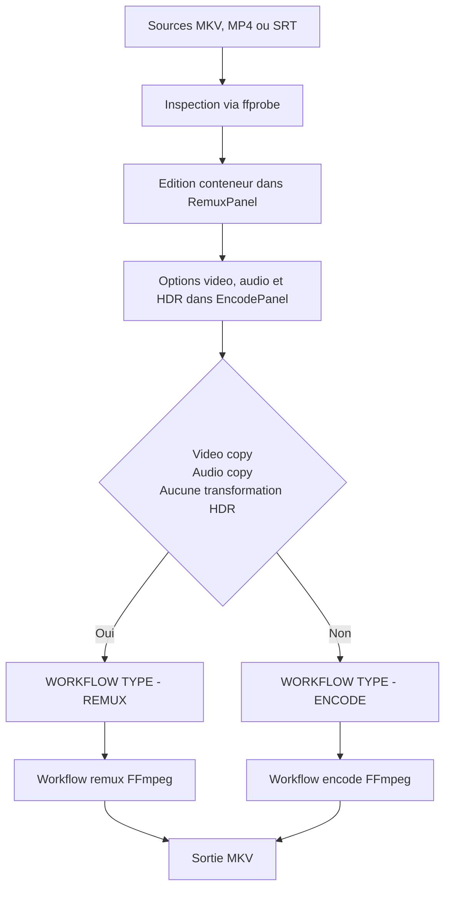
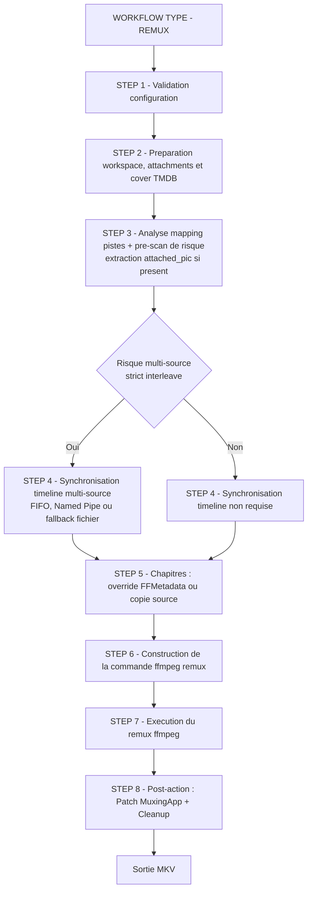
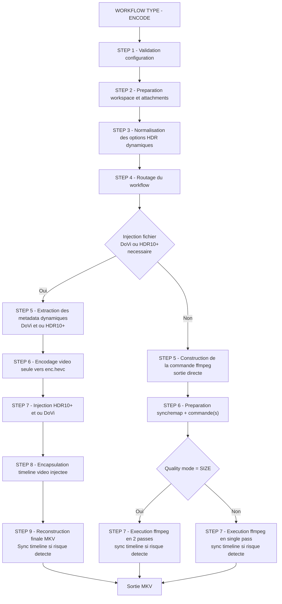
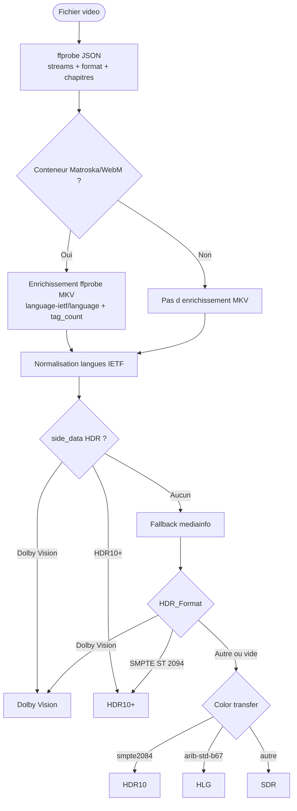

# 🎬 Mediarecode

FULL Vibecoded App for Proof of Concept - no human code, only human prompts and eyes.

Interface graphique pour préparer des fichiers vidéo, remuxer sans perte, réencoder avec `ffmpeg`, et fusionner des métadonnées Dolby Vision / HDR10+.

Cette documentation correspond à **Mediarecode v1.4.1**.

## Sommaire

- [Vue rapide](#vue-rapide)
- [Installation](#installation)
  - [Prérequis](#prérequis)
  - [Cloner le dépôt](#cloner-le-dépôt)
  - [Installer les dépendances et les outils](#installer-les-dépendances-et-les-outils)
  - [Lancer l'application](#lancer-lapplication)
- [Windows - Version .exe uniquement](#windows---version-exe-uniquement)
  - [Windows Security / Controlled Folder Access](#windows-security--controlled-folder-access)
- [Distribution](#distribution)
- [Interface et usage](#interface-et-usage)
  - [Tableau de bord](#tableau-de-bord)
  - [Conteneur & Encodage](#conteneur--encodage)
  - [Fusion DoVi / HDR10+](#fusion-dovi--hdr10)
  - [Paramètres](#paramètres)
- [Thèmes](#thèmes)
- [Localisation](#localisation)
- [Configuration](#configuration)
  - [Priorité des réglages](#priorité-des-réglages)
  - [Paramètres principaux](#paramètres-principaux)
  - [Buffer RAM](#buffer-ram)
  - [Outils configurables](#outils-configurables)
- [Workflows](#workflows)
  - [Conteneur & Encodage — Routage global](#conteneur--encodage--routage-global)
  - [Backend remux `ffmpeg` — Branches internes](#backend-remux-ffmpeg--branches-internes)
  - [Encode workflow — Branches internes](#encode-workflow--branches-internes)
  - [Fusion DoVi / HDR10+](#fusion-dovi--hdr10-1)
  - [Détection HDR d'un fichier](#détection-hdr-dun-fichier)
- [Outils externes](#outils-externes)

## Vue rapide

| Outil | Usage | Qualité |
|-------|-------|---------|
| **Conteneur & Encodage** | sélectionner les pistes, les réordonner, éditer langue/titre/flags, gérer titre/tags/chapitres/pièces jointes, enrichir les tags via TMDB/IMDb, puis copier ou réencoder | copie = sans perte, encodage = avec recompression |
| **Fusion DoVi / HDR10+** | injecter les métadonnées HDR d'un fichier source dans le flux vidéo HEVC d'un autre fichier | sans perte |

> Les panneaux **Remuxage** et **Encodage** forment un seul workflow. Le panneau Remuxage prépare le conteneur ; le panneau Encodage décide comment traiter la vidéo et l'audio.

**Drag-and-drop global** : n'importe quel fichier média peut être déposé directement sur la fenêtre principale, quelle que soit la page active. Les formats sources supportés sont centralisés dans `core/file_types.py` (MKV, MP4, MOV, M4V, AVI, TS, M2TS, WEBM, HEVC brut, SRT, etc.).

## Installation

### Prérequis

- **Python 3.10+**

`setup.py` installe ensuite **tous les autres prérequis** pour **Windows**, **Linux Fedora / RHEL**, **Linux Debian / Ubuntu** et **macOS**, y compris **PySide6** et les outils externes nécessaires.

### Cloner le dépôt

```bash
git clone <url-du-depot>
cd mediarecode
```

### Installer les dépendances et les outils

Le script `setup.py` installe automatiquement :

| Catégorie | Installé par `setup.py` |
|-----------|-------------------------|
| Dépendance Python | `PySide6` |
| Outils système | `ffmpeg`, `ffprobe`, `mediainfo` |
| Outils GitHub | `dovi_tool`, `hdr10plus_tool` |
| Notes plateforme | Debian/Ubuntu via `apt`, Fedora/RHEL via `dnf`, macOS via Homebrew, Windows via `winget` + binaires locaux |

> `setup.py` renseigne `config.ini` avec les chemins détectés.  
> Emplacement de `config.ini` : Linux/macOS `~/.config/mediarecode/config.ini` (XDG), Windows dev `./config.ini`, Windows packagé `%APPDATA%\mediarecode\config.ini`.

| Plateforme | Commande | Détails |
|------------|----------|---------|
| Linux Debian / Ubuntu | `python3 setup.py` | installe `ffmpeg`, `mediainfo` via `apt`, puis `dovi_tool` et `hdr10plus_tool` depuis GitHub |
| Linux Fedora / RHEL | `python3 setup.py` | active RPM Fusion si nécessaire, installe `ffmpeg`, `mediainfo` via `dnf`, puis les outils GitHub |
| macOS | `python3 setup.py` | installe `ffmpeg`, `mediainfo` via Homebrew, puis `dovi_tool` et `hdr10plus_tool` |
| Windows | `py setup.py` | installe `ffmpeg` et `mediainfo` via `winget`, place `dovi_tool` et `hdr10plus_tool` dans `mediarecode\tools`, puis renseigne `config.ini` avec les chemins détectés |

Options utiles du script :

| Option | Effet |
|--------|-------|
| `--dry-run` | affiche les actions sans les exécuter |
| `--no-github` | n'installe pas `dovi_tool` ni `hdr10plus_tool` |
| `--prefix PATH` | change le dossier d'installation des binaires GitHub |
| `--force` | relance les installations et régénère les chemins Windows dans `config.ini` |

`eac3to` est optionnel et non installable automatiquement. Il reste utile sous Windows pour certains traitements audio avancés.

### Lancer l'application

```bash
python3 main.py
```

Sous Windows, utilisez `py main.py`.

## Windows - Version .exe uniquement

Cette notice ne concerne que les lancement depuis Mediarecode.exe

Le lancement via python (py main.py) n'est pas concerné.

### Windows Security / Controlled Folder Access

Sous Windows, les bibliothèques utilisateur comme **Videos**, **Documents**, **Pictures** et dossiers similaires peuvent être protégées par **Windows Security** via **Controlled Folder Access**.

Quand cette protection est active, Mediarecode peut être empêché d'écrire directement dans ces dossiers, même si :

- le dossier existe ;
- vous pouvez y accéder manuellement depuis l'Explorateur ;
- le chemin affiché dans l'application est correct.

Symptômes fréquents :

- popup **Sécurité Windows** indiquant que `mediarecode.exe` ou un outil comme `ffmpeg.exe` a été bloqué ;
- erreur `No such file or directory` lors d'un export vers `Videos` ou `Documents` ;
- succès de l'export vers un autre dossier non protégé, comme `Desktop` ou `%TEMP%`.

Au premier setup Windows, Mediarecode peut proposer d'ajouter ses exécutables à l'allowlist de Windows Security afin de pouvoir enregistrer directement dans ces bibliothèques protégées. Cette exception concerne l'application elle-même et `ffmpeg`, l'outil qui écrit effectivement les fichiers de sortie.

Sans cette exception, les exports directs vers **Videos**, **Documents**, **Pictures**, etc. peuvent rester bloqués.

Si vous refusez l'exception ou si vous devez la configurer manuellement :

1. Ouvrez **Sécurité Windows**.
2. Allez dans **Protection contre les virus et menaces**.
3. Ouvrez **Protection contre les ransomwares** puis **Gérer la protection contre les ransomwares**.
4. Entrez dans **Autoriser une application via l'accès contrôlé aux dossiers**.
5. Ajoutez `mediarecode.exe`.
6. Si nécessaire, ajoutez aussi `ffmpeg.exe`.

Après ajout à l'allowlist, redémarrez Mediarecode avant de retester un export vers `Videos` ou `Documents`.

## Distribution

L'application peut également être distribuée sous forme de binaire autonome via `package.py`.

Les artefacts sont toujours déposés dans `dist/releases/`.

| Cible | Commande | Artefact produit |
|-------|----------|-----------------|
| AppImage Linux | `python3 package.py --allinc` | `dist/releases/Mediarecode-x86_64.AppImage` + `dist/releases/Mediarecode-x86_64.AppImage.zsync` |
| Package macOS natif | `python3 package.py --dmg` | `Mediarecode.app` + `dist/releases/Mediarecode-<version>.dmg` |
| Package Windows (natif + MSIX) | `py package.py --msix` | `dist/releases/Mediarecode.msix` |
| Soumission Microsoft Store | `py package.py --msix --msixupload --store-config packaging/msix_store.json` | `dist/releases/Mediarecode.msixupload` |
| Installateur Windows cross (depuis Linux) | `python3 package.py --windows` | `dist/releases/Mediarecode-Setup.exe` via Wine + NSIS |

`--allinc` est requis sur Linux : il intègre toutes les dépendances dans l'AppImage et génère le fichier `.zsync` associé pour les mises à jour différentielles.

Le workflow GitHub Windows de release publie désormais l’installateur **NSIS** (`.exe`) dans les releases GitHub.

Le workflow `Build Windows Store upload` est séparé, manuel, et ne publie rien dans les releases. Il sert uniquement à produire un **`.msixupload`** pour Partner Center.

Pour une vraie soumission Microsoft Store, il faut renseigner l’identité exacte réservée dans Partner Center :

- copier `packaging/msix_store.example.json` vers `packaging/msix_store.json`
- remplacer `identity` et `publisher` par les valeurs de la page **Product identity** dans Partner Center
- sur GitHub Actions, exposer ces mêmes valeurs via `WINDOWS_MSIX_IDENTITY`, `WINDOWS_MSIX_PUBLISHER`, `WINDOWS_MSIX_PUBLISHER_DISPLAY_NAME` et `WINDOWS_MSIX_DESCRIPTION`

Le dépôt peut générer l’artefact de soumission, mais il ne peut pas inventer à ta place les valeurs Partner Center ni les captures/listings Store.

Important : le workflow Store upload reste distinct du workflow release. Les releases GitHub ne contiennent donc plus de MSIX.

Si `makeappx.exe` ou `signtool.exe` sont absents, le build Windows tente d’installer le SDK requis avant de packager. Un override explicite reste possible via `MEDIARECODE_WINDOWS_SDK_INSTALLER` ou `MEDIARECODE_WINDOWS_SDK_WINGET_ID`.

Sous Windows packagé, le lancement de l’application rejoue automatiquement `setup.py` au premier démarrage après installation ou mise à jour, afin de réinstaller les dépendances externes manquantes et de régénérer les chemins dans `config.ini`.

Options utiles de `package.py` :

| Option | Effet |
|--------|-------|
| `--allinc` | intègre toutes les dépendances dans l'AppImage et génère le `.zsync` (Linux) |
| `--dmg` | sur macOS natif, produit un `.dmg` distribuable depuis `Mediarecode.app` |
| `--msix` | produit un package MSIX sur Windows natif, signé si les variables `MEDIARECODE_MSIX_*` sont définies |
| `--msixupload` | génère un `.msixupload` pour Partner Center à partir du package MSIX |
| `--store-config PATH` | charge les métadonnées Store/MSIX depuis un JSON dédié |
| `--windows` | cross-compile un installateur Windows depuis Linux via Wine + NSIS |
| `--skip-wine` | réutilise `dist/mediarecode-win/` existant (saute l'étape Wine/PyInstaller) |
| `--clean` | nettoie tous les artefacts de build (`build/`, `dist/`, `.wine_build/`, `*.AppImage`…) |

## Interface et usage

### Tableau de bord

Le tableau de bord affiche :

- l'état des outils externes détectés
- les dossiers configurés (travail, sortie, app data)
- les encodeurs logiciels vus par `ffmpeg -encoders`
- les encodeurs matériels réellement testés au runtime (`NVENC`, `AMF`, `VAAPI`, `QSV`)

> Les encodeurs matériels ne sont pas marqués disponibles simplement parce qu'ils apparaissent dans `ffmpeg`. L'application lance un probe réel pour confirmer qu'ils fonctionnent. Les probes sont exécutés en parallèle pour minimiser le délai au démarrage.

### Conteneur & Encodage

Le workflow unifié permet de :

- ajouter une ou plusieurs sources MKV / MP4 / SRT
- inspecter vidéo, audio, sous-titres, chapitres, pièces jointes et tags MKV
- activer, exclure et réordonner les pistes
- éditer langue, titre et flags de chaque piste
- créer des variantes audio indépendantes depuis l'onglet Encodage, sans modifier la piste d'origine
- réordonner ou supprimer ces variantes sans perdre leur lien avec le workflow
- visualiser dans le panel remux le codec et le bitrate cibles lorsqu'une piste audio sera réencodée
- extraire une piste de sous-titre depuis le menu contextuel du tableau des pistes
- définir le titre du conteneur, les balises globales, les chapitres et les pièces jointes
- ouvrir une fenêtre de recherche **TMDB** depuis le panneau balises pour rechercher film/série (préremplissage auto depuis titre/nom de fichier)
- détecter automatiquement les motifs de série (`SxxExx`, `x`) pour préremplir saison/épisode et positionner la recherche sur **Séries** si pertinent
- injecter les métadonnées TMDB dans les tags MKV (`DATE_RELEASED`, `GENRE`, `DIRECTOR`, `CAST`, `SUBTITLE`, `SYNOPSIS`, `COUNTRY`, `URL`, `DESCRIPTION`, `COLLECTION`, `SEASON`, `EPISODE`)
- préparer une cover TMDB en mode différé (URL + nom de fichier) ; le téléchargement réel est fait au lancement du workflow
- remplacer automatiquement le **titre du conteneur** par le titre formaté TMDB lors de la validation (film : `Titre (Année)`, série : `Titre - SxxExx - Titre épisode`)
- choisir pour chaque piste audio un mode `copy`, `aac`, `eac3` ou `flac`
- choisir pour la vidéo `copy`, `libx265`, `libx264`, `libsvtav1`, `NVENC`, `AMF`, `VAAPI` ou `QSV` — avec support complet **HEVC**, **H.264** et **AV1** sur chaque famille matérielle
- presets dédiés par famille matérielle : `NVENC_PRESETS` (p1-p7 + slow/medium/fast/hp/hq), `VAAPI_PRESETS` (compression_level 0-7), `QSV_PRESETS` (veryslow → veryfast), `AMF_PRESETS` (quality/balanced/speed)
- **offload matériel complet** : décodage GPU activé automatiquement quand un encodeur matériel compatible est sélectionné (`cuda` pour NVENC, `qsv` pour QSV, `vaapi` pour VAAPI, `d3d11va` pour AMF Windows) — le CPU n'est plus sollicité pour le décodage en chemin pur hardware
- configuration VAAPI optimisée : `rc_mode CQP/VBR` selon le mode qualité, `compression_level` exposé via preset, `async_depth 4` pour maximiser le pipeline GPU
- backend de remux nominal : `ffmpeg`

Modes d'exécution :

| Condition | Mode | Outils utilisés |
|-----------|------|-----------------|
| vidéo en `copy`, audio en `copy`, aucune transformation HDR | **Remuxage pur** | `ffmpeg` (langues BCP47 via tag `language`, purge `language-ietf`, chapitres, tags globaux, pièces jointes, champ `Muxing Application`) |
| tout autre cas | **Encodage** | `ffmpeg` en passe de sortie unique (encodage/remux final + chapitres, tags, langue/titre de pistes, `Muxing Application`) |

Les fichiers **SRT** peuvent être ajoutés comme sources séparées de sous-titres. Ils sont détectés automatiquement et intégrés dans le remux final avec le format correct (`srt`).

Backend remux `ffmpeg` (par défaut) :

- sortie limitée à `MKV`
- écrit la langue de piste en BCP47 sur `language` (ex. `fr-FR`) et purge le champ legacy `language-ietf` pour éviter les doublons incohérents
- corrige au besoin les tags de langue Matroska en post-action, sans repasser par MKVToolNix
- permet la recopie ou l'édition des chapitres
- permet d'écrire les tags globaux choisis
- permet de recopier les pièces jointes source sélectionnées et d'ajouter des fichiers externes (cover incluse)
- peut générer un fichier `.nfo` MediaInfo à côté du MKV final après un remux ou un encodage réussi
- télécharge la cover TMDB différée juste avant l'exécution (dans le dossier temporaire du process), puis nettoie ce dossier en fin de run
- purge explicitement les balises techniques source `ENCODER` et `CREATION_TIME` avant écriture des métadonnées de sortie
- n'écrit plus le tag libre `MUXING_APPLICATION` via `-metadata`
- applique un patch binaire post-action (sans MKVToolNix) sur le header Matroska pour écrire **MuxingApp** (`0x4D80`) à la valeur unique `Mediarecode {version}` ; **WritingApp** (`0x5741`) reste intact

Limites connues du backend remux `ffmpeg` :

- pas de support des structures XML avancées de tags Matroska (cibles hiérarchiques fines)
- pas d'édition du flag Matroska `track-enabled` (non exposé par FFmpeg)
- la réécriture post-action reconstruit l'EBML du header si la valeur MuxingApp est plus longue que le champ existant ; en cas d'échec, le patch est ignoré avec warning

Les options HDR disponibles côté encodage sont :

- injection de métadonnées HDR10 statiques
- tone mapping HDR vers SDR
- copie DoVi / HDR10+ depuis la source avec workflow multi-étapes

Ergonomie du panneau :

- aperçu **cover** cliquable avec modale zoom plein écran (cover TMDB, cover Matroska extraite via `core/matroska_attachment_extractor.py`, pièces jointes image)
- **barre de progression à rattrapage exact** : tant que `ffmpeg -progress` n'émet pas encore `out_time`, la progression est estimée via `frame=` et le nombre total d'images du fichier source ; dès que `out_time` devient disponible, la valeur exacte prend le relais
- **suppression de source accélérée** via suivi incrémental (pas de rescan global à chaque retrait)
- covers TMDB cliquables dans les résultats de recherche (aperçu grand format avant validation)

### Fusion DoVi / HDR10+

Ce panneau prend :

- **Film 1** : la vidéo cible à enrichir (`.mkv` ou `.hevc`)
- **Film 2** : la source HDR contenant Dolby Vision et/ou HDR10+ (`.mkv` ou `.hevc`)

Règles importantes :

- Film 1 et Film 2 doivent contenir de la **vidéo HEVC**
- Film 2 doit contenir **Dolby Vision** et/ou **HDR10+**
- l'écart de frame count doit être **<= 4 images**
- le remux final conserve l'audio et les sous-titres de Film 1

Le workflow UI Fusion DoVi/HDR10+ est désormais **FFmpeg-only** pour l'extraction HEVC et le remux final (plus de dépendance MKVToolNix dans ce panneau).

Profils Dolby Vision proposés :

| Profil | Effet |
|--------|-------|
| **Profile 8.1** | normalise l'injection en profil 8.1, recommandé pour les remux UHD |
| **Mode 0** | conserve le profil source sans réécriture |

### Paramètres

Le panneau **Paramètres** est un éditeur complet de `config.ini` intégré à l'interface. Il regroupe :

- **Interface** : thème (`dark` / `light`), langue, nombre maximal de lignes de log, panneau affiché au démarrage
- **Chemins** : dossier de travail, dossier de sortie, dossier app data
- **Remux** : backend `ffmpeg` (nominal)
- **Outils externes** : chemins explicites pour chaque outil (`ffmpeg`, `ffprobe`, `mediainfo`, `dovi_tool`, `hdr10plus_tool`, etc.)
- **Encodage** : profil DoVi, compat-id, buffer RAM
- **Métadonnées** : auth TMDB via clé API v3 (`tmdb_api_key`) ou token Bearer v4 (`tmdb_bearer_token`), génération optionnelle de `.nfo` (`generate_nfo`)

Les changements sont appliqués section par section ou en une seule fois via le bouton **Sauvegarder toute la configuration**. Un rechargement depuis `config.ini` est possible sans redémarrer l'application.

## Thèmes

L'application supporte deux thèmes visuels, sélectionnables dans le panneau Paramètres :

| Thème | Description |
|-------|-------------|
| `dark` (défaut) | fond sombre, accents bleus |
| `light` | fond clair, contrastes adaptés |

Le changement de thème est appliqué immédiatement sans redémarrage.

## Localisation

L'interface est traduite en **français** et **anglais**. La langue active est détectée automatiquement depuis la locale système au premier lancement, puis peut être modifiée dans le panneau Paramètres.

Les textes de l'application sont centralisés dans `locales.json`.

Les tags de langue saisis (pistes audio, sous-titres) utilisent des codes RFC 5646 / BCP47 (ex. `fr`, `fr-FR`, `en-US`). Les libellés non standards comme `French` ne sont pas acceptés.

## Configuration

### Priorité des réglages

L'application résout ses paramètres dans cet ordre :

1. `config.ini` (Linux/macOS : `~/.config/mediarecode/config.ini` ; Windows dev : racine du projet ; Windows packagé : `%APPDATA%\mediarecode\config.ini`)
2. les valeurs persistées par l'interface (`QSettings`)
3. les valeurs par défaut internes

Sous Windows, `setup.py` et le démarrage de l'application peuvent auto-détecter les outils et renseigner automatiquement la section `[tools]` de `config.ini`.

### Paramètres principaux

| Paramètre | Défaut | Description |
|-----------|--------|-------------|
| `work_dir` | `/tmp/mediarecode_work` sur Linux/macOS, `%TEMP%\mediarecode_work` sur Windows | dossier des fichiers temporaires |
| `output_dir` | dossier Vidéos de l'OS | dossier de sortie par défaut |
| `theme` | `dark` | thème visuel (`dark` ou `light`) |
| `language` | auto-détecté | langue de l'interface (`fra` ou `eng`) |
| `startup_panel` | `dashboard` | panneau ouvert au démarrage (`dashboard`, `container`, `encoding`, `dovi`, `settings`) |
| `backend` (section `[remux]`) | `ffmpeg` | backend de remux (`ffmpeg`) |
| `tmdb_api_key` | vide | clé API TMDB v3 utilisée par la recherche IMDb/TMDB |
| `tmdb_bearer_token` | vide | token Bearer TMDB v4 (utilisé si `tmdb_api_key` est vide, ou via `MEDIARECODE_TMDB_BEARER_TOKEN`) |
| `generate_nfo` | `true` | génère un fichier `.nfo` MediaInfo à côté du MKV final après workflow réussi |
| `ram_buffer_enabled` | `true` | autorise l'usage de `/dev/shm` pour les HEVC intermédiaires si disponible |
| `ram_buffer_threshold_pct` | `15` | pourcentage minimal de RAM libre à conserver pour activer ce buffer |

### Buffer RAM

Le workflow d'encodage peut placer les fichiers HEVC temporaires en RAM pour limiter les E/S disque.

Conditions d'utilisation :

- `ram_buffer_enabled = true`
- un répertoire RAM-backed disponible et inscriptible (`/dev/shm`)
- après allocation estimée, la RAM libre reste au-dessus du seuil `ram_buffer_threshold_pct`

Comportement :

- si toutes les conditions sont remplies, les intermédiaires HEVC sont écrits en RAM
- sinon, fallback automatique vers le dossier temporaire sur disque (`work_dir` ou temporaire système)
- la décision est réévaluée à chaque allocation

Limite Windows :

- l'application ne s'appuie pas sur un backend RAM standard sur Windows
- le chemin par défaut reste donc disque pour garantir un comportement stable et compatible avec les outils externes (`ffmpeg`, `dovi_tool`, `hdr10plus_tool`) qui attendent des chemins de fichiers classiques

### Outils configurables

Vous pouvez définir explicitement dans `config.ini` :

- `ffmpeg`, `ffprobe`
- `mediainfo`
- `dovi_tool`, `hdr10plus_tool`
- `eac3to`

Exemple :

```ini
[paths]
output_dir = /mnt/nas/videos

[tools]
ffmpeg = /opt/ffmpeg/bin/ffmpeg
dovi_tool = /usr/local/bin/dovi_tool

[remux]
backend = ffmpeg

[ui]
theme = light
language = eng
startup_panel = container

[metadata]
tmdb_api_key = <VOTRE_CLE_API_TMDB_V3>
tmdb_bearer_token = <VOTRE_TOKEN_BEARER_TMDB_V4>
generate_nfo = true
```

## Workflows

### Conteneur & Encodage — Routage global



### Backend remux `ffmpeg` — Branches internes



### Encode workflow — Branches internes



Lecture rapide :
- Les demandes `copy_hdr10plus` et `copy_dv` sont evaluees apres normalisation source.
- L'injection "fichier" n'est requise que si une copie DoVi ou HDR10+ reste demandee et que la video n'est pas en `copy`.
- Si `codec=copy` avec injection desactivee, le workflow reste en sortie directe ffmpeg (STEP 5-7), y compris si l'audio est reencode.
- Le 2-pass n'existe que dans le chemin direct (`quality_mode=SIZE`, `codec!=copy`).
- Le chemin injection utilise `enc.hevc`, puis `enc_wrapped.mkv`, puis un remux final ffmpeg (STEP 5-9).
- La sync timeline multi-source est activee uniquement en cas de risque detecte par pre-scan ffprobe ; sinon le flux reste en chemin direct.
- En mode TMDB, la cover est resolue en URL lors de la recherche puis telechargee uniquement au lancement du workflow.

### Fusion DoVi / HDR10+


### Détection HDR d'un fichier



## Outils externes

| Outil | Rôle principal |
|-------|----------------|
| `ffprobe` | analyse des flux, chapitres et métadonnées |
| `mediainfo` | frame count et informations HDR fines |
| `ffmpeg` | encodage, remux, copie de flux, extraction de sous-titres, écriture metadata/chapitres/tags, patch binaire MuxingApp |
| `dovi_tool` | extraction, injection et vérification Dolby Vision |
| `hdr10plus_tool` | extraction et injection HDR10+ |
| `nvidia-smi` | fallback de détection NVENC sous Linux |

---

*Mediarecode v1.4.1*
