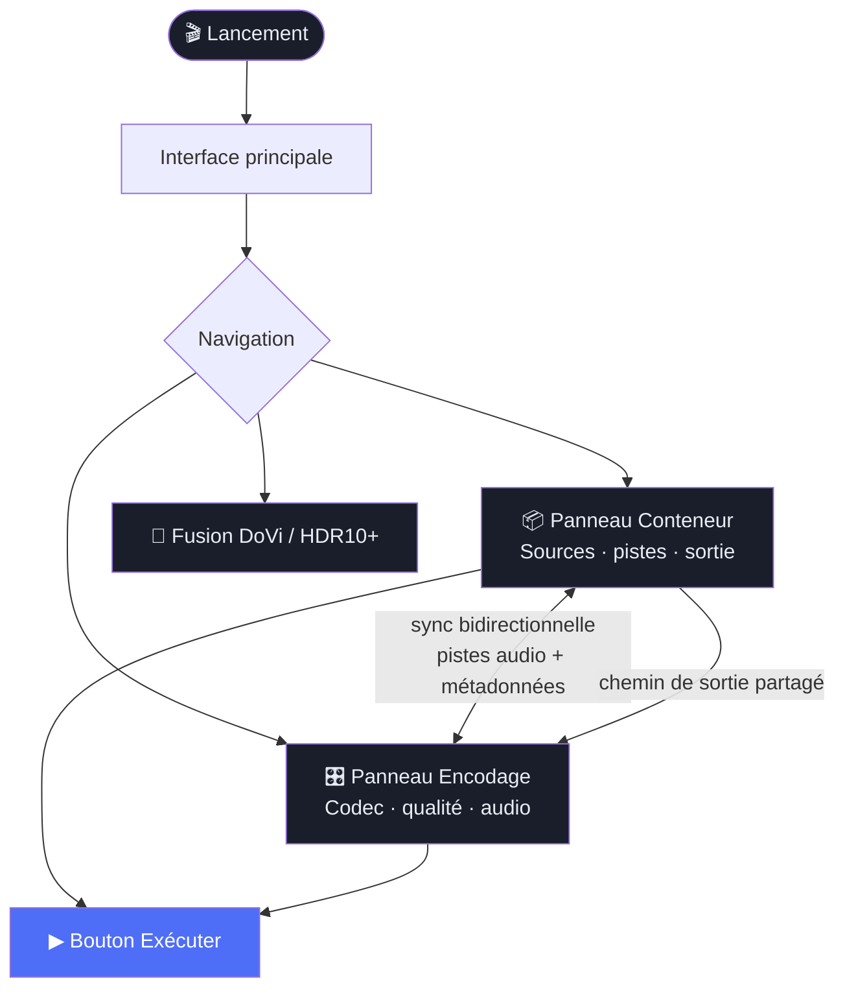
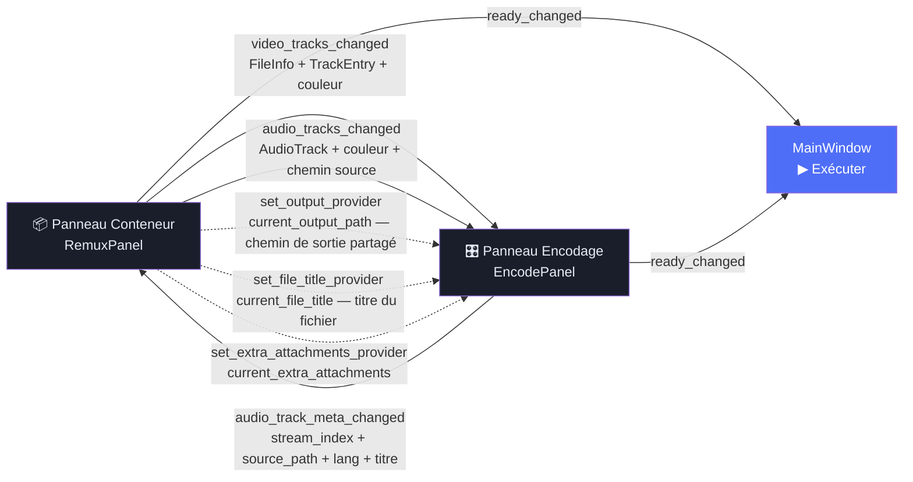
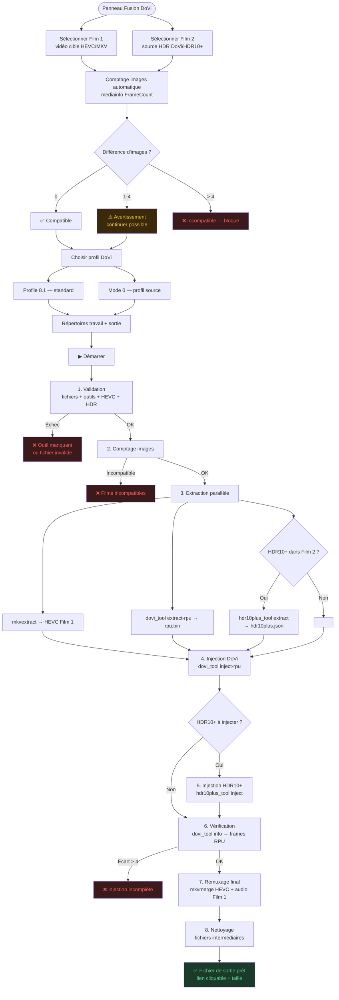
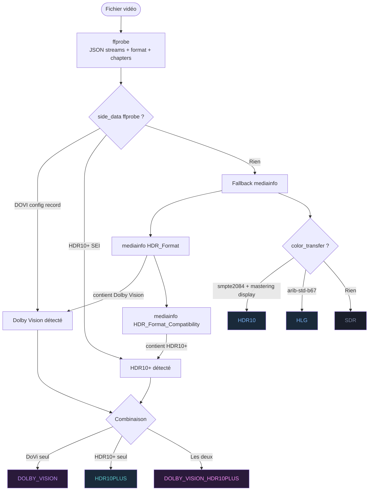

# 🎬 MKV/MP4 Toolkit

Interface graphique pour le traitement avancé de fichiers vidéo MKV et MP4 — sélection et réorganisation de pistes, injection de métadonnées HDR Dolby Vision / HDR10+, et encodage vidéo.

---

## 📋 Table des matières

- [À quoi ça sert ?](#-à-quoi-ça-sert-)
- [Prérequis](#-prérequis)
- [Lancement](#-lancement)
- [Interface générale](#-interface-générale)
- [Fonctionnalité 1 — Traitement conteneur + encodage](#-fonctionnalité-1--traitement-conteneur--encodage)
- [Fonctionnalité 2 — Fusion Dolby Vision / HDR10+](#-fonctionnalité-2--fusion-dolby-vision--hdr10)
- [Paramètres et configuration](#️-paramètres-et-configuration)
- [Schéma des workflows](#-schéma-des-workflows)

---

## 🤔 À quoi ça sert ?

Ce logiciel s'adresse aux personnes qui travaillent avec des fichiers vidéo haute qualité (films UHD 4K, Blu-ray numérisés, etc.) et qui ont besoin d'effectuer des opérations précises sur leurs fichiers.

### Deux fonctionnalités principales

| Fonctionnalité | Description | Perd de la qualité ? |
|---------------|-------------|----------------------|
| **Traitement conteneur + encodage** | Sélectionner, réorganiser et configurer les pistes d'un ou plusieurs fichiers, puis choisir si la vidéo doit être copiée ou réencodée | Selon le choix : ❌ Non (copie) / ⚠️ Oui (encodage) |
| **Fusion HDR** | Injecter les métadonnées Dolby Vision et/ou HDR10+ d'un fichier source dans un autre | ❌ Non |

### Glossaire rapide pour débutant

| Terme | Explication simple |
|-------|--------------------|
| **MKV** | Format de conteneur vidéo (comme une boîte qui contient vidéo + audio + sous-titres) |
| **Piste** | Un flux dans le fichier : une piste vidéo, une piste audio, une piste de sous-titres |
| **Remuxage** | Changer le contenu de la boîte sans toucher à la vidéo elle-même (copie pure, sans perte) |
| **Encodage** | Recompresser la vidéo avec un algorithme — prend du temps, réduit la taille mais altère légèrement la qualité |
| **HDR** | High Dynamic Range — image avec plus de luminosité et de couleurs qu'un écran standard |
| **Dolby Vision** | Format HDR propriétaire avec métadonnées dynamiques par image |
| **HDR10+** | Format HDR ouvert avec métadonnées dynamiques (Samsung, Amazon) |
| **RPU** | Les données Dolby Vision en binaire, séparées de la vidéo elle-même |
| **CRF** | Constante de qualité pour l'encodage : plus c'est bas, meilleure est la qualité |
| **Codec** | L'algorithme de compression vidéo : H.264, H.265 (HEVC), AV1… |

---

## 📦 Prérequis

### Dépendances Python

- Python 3.10+
- PySide6

```bash
pip install PySide6
```

### Outils externes requis

Ces programmes doivent être installés et accessibles dans le `PATH` :

| Outil | Rôle | Requis pour |
|-------|------|-------------|
| `ffmpeg` | Encodage vidéo et audio, assemblage final | Encodage |
| `ffprobe` | Analyse des fichiers vidéo | Toutes les fonctions |
| `mkvmerge` | Remuxage pur (copie sans encodage) + remuxage final HDR | Copie pure, Fusion HDR |
| `mkvextract` | Extraction de pistes | Fusion HDR |
| `mkvinfo` | Informations MKV | Analyse |
| `mediainfo` | Métadonnées et comptage d'images | Fusion HDR, Analyse |
| `dovi_tool` | Extraction / injection RPU Dolby Vision | Fusion HDR, HDR passthrough |
| `hdr10plus_tool` | Extraction / injection HDR10+ | Fusion HDR, HDR passthrough |

> **Note** : Les chemins vers ces outils sont configurables dans les paramètres s'ils ne sont pas dans le PATH système.

---

## 🚀 Lancement

```bash
cd mediarecode
python mkv_toolkit/main.py
```

Ou via le script d'installation :

```bash
python3 setup.py          # installe toutes les dépendances
python mkv_toolkit/main.py
```

---

## 🖥️ Interface générale

L'interface est divisée en trois zones :

```
┌──────────┬──────────────────────────────────────────┐
│          │                                          │
│  Barre   │         Zone principale                  │
│  de      │   (change selon l'onglet sélectionné)    │
│  naviga- │                                          │
│  tion    │                                          │
│          │                                          │
├──────────┴──────────────────────────────────────────┤
│              Journal de log (pliable)               │
└─────────────────────────────────────────────────────┘
```

### Barre de navigation (gauche)

| Bouton | Page |
|--------|------|
| Tableau de bord | Page d'accueil |
| Fusion DoVi | Injection Dolby Vision / HDR10+ |
| Encodage | Configuration codec/qualité — **lié au panneau Conteneur** |
| Conteneur | Sélection et organisation des pistes sources |
| Paramètres | Configuration des outils et chemins |

### Journal de log (bas)

Le journal affiche en temps réel toutes les commandes et leur progression. Les messages sont colorés :

- 🔵 `INFO` — Information normale
- 🟢 `OK` — Succès
- 🟡 `WARN` — Avertissement
- 🔴 `ERROR` — Erreur

Le journal est pliable (cliquer sur l'en-tête).

---

## 📦 Fonctionnalité 1 — Traitement conteneur + encodage

### Vue d'ensemble : deux panneaux, un seul bouton Exécuter

Les panneaux **Conteneur** et **Encodage** sont liés et fonctionnent ensemble comme une seule opération. Ils partagent les données en temps réel :

- Le panneau **Conteneur** définit les sources, les pistes sélectionnées, leur ordre, le chemin de sortie, les chapitres et les pièces jointes.
- Le panneau **Encodage** définit si la vidéo doit être réencodée et avec quel codec/qualité. Il reçoit automatiquement les pistes audio configurées dans le panneau Conteneur.
- Un seul bouton **Exécuter** dans la barre principale lance l'opération complète.

**L'outil utilisé est déterminé automatiquement** selon la configuration :

| Configuration | Outil | Durée |
|---------------|-------|-------|
| Tous les codecs sur "Copie" + pas d'injection HDR | `mkvmerge` uniquement | Instantané |
| Au moins un codec actif OU injection HDR | `ffmpeg` (+ `mkvpropedit` post-traitement) | Selon la durée du fichier |

---

### Panneau Conteneur — configuration des pistes

#### 1. Ajouter des fichiers sources

Glisser-déposer un ou plusieurs fichiers MKV/MP4 dans la zone de liste.
Chaque fichier est analysé automatiquement. Une couleur unique est attribuée à chaque source.

> 💡 Plusieurs sources permettent de combiner des pistes de fichiers différents (ex : vidéo d'un fichier, audio d'un autre).

#### 2. Inspecter un fichier (optionnel)

Cliquer sur **Inspecter** à côté d'un fichier pour voir le détail de ses pistes :
- Onglet **Vidéo** : codec, résolution, fréquence d'images, profondeur, type HDR
- Onglet **Audio** : codec, canaux, débit, indicateurs Atmos/DTS:X
- Onglet **Sous-titres** : codec, langue, drapeaux forcé/défaut
- Onglet **Chapitres** : liste des chapitres

#### 3. Sélectionner et réorganiser les pistes

Le tableau liste toutes les pistes de tous les fichiers.

| Colonne | Description |
|---------|-------------|
| Type | V (vidéo), A (audio), S (sous-titres) |
| Codec | Le codec de la piste |
| Info | Résolution + HDR, canaux + débit selon le type |
| Langue | Code BCP-47 (ex : `fr`, `en-US`) |
| Titre | Nom de la piste |
| Activée | Case à cocher pour inclure/exclure la piste |

**Réordonner** : glisser-déposer les lignes pour changer l'ordre dans le fichier de sortie.
**Exclure** : décocher la case "Activée".

#### 4. Modifier les métadonnées d'une piste

Double-cliquer sur une ligne ouvre un dialogue d'édition :

- **Langue** : code RFC 5646 (ex : `fr`, `en`, `ja`, `zh-Hans`) — validé en temps réel
- **Titre** : nom libre
- **Drapeaux** :
  - `Défaut` : cette piste est sélectionnée par défaut
  - `Forcé` : sous-titres forcés (s'affiche toujours)
  - `Malentendant` : contient descriptions pour malentendants
  - `Déficient visuel` : contient descriptions audio
  - `Original` : langue originale du contenu
  - `Commentaire` : piste de commentaire audio

> Les modifications de langue et de titre sont synchronisées automatiquement avec le panneau Encodage (et vice-versa).

#### 5. Options globales

- **Conserver les chapitres** : inclure les chapitres dans le fichier de sortie
- **Sélectionner les pièces jointes** : choisir les fichiers attachés à inclure (ex : couverture)

#### 6. Chemin de sortie

Saisir ou sélectionner le chemin du fichier de sortie. **Ce chemin est partagé avec le panneau Encodage** — il n'y a qu'un seul fichier de sortie.

---

### Panneau Encodage — configuration codec/qualité

Le panneau Encodage reçoit automatiquement les pistes audio activées depuis le panneau Conteneur. Il permet de configurer le traitement vidéo et audio indépendamment.

#### 1. Codec vidéo

Si le codec est laissé sur **Copie**, la vidéo n'est pas réencodée (opération instantanée et sans perte). Sinon, choisir parmi :

##### Codecs logiciels (CPU)

| Codec | Description | Usage recommandé |
|-------|-------------|-----------------|
| `libx265` | x265 — HEVC | Meilleure compression, standard actuel |
| `libx264` | x264 — H.264 | Compatibilité maximale |
| `libsvtav1` | SVT-AV1 | Compression excellente, plus lent |

##### Codecs matériels (GPU) — détectés automatiquement au démarrage

| Codec | Description |
|-------|-------------|
| `hevc_nvenc` | HEVC via GPU NVIDIA |
| `hevc_amf` | HEVC via GPU AMD |
| `hevc_qsv` | HEVC via GPU Intel |
| `h264_nvenc` | H.264 via GPU NVIDIA |
| `h264_amf` | H.264 via GPU AMD |
| `h264_qsv` | H.264 via GPU Intel |

> Les codecs matériels sont beaucoup plus rapides mais la qualité est légèrement inférieure à iso-paramètres.

#### 2. Mode de qualité (si réencodage actif)

| Mode | Description | Quand l'utiliser |
|------|-------------|-----------------|
| **CRF** — Qualité constante | Valeur de 0 (parfait) à 51 (médiocre). La taille varie. | Usage standard recommandé |
| **Débit** — Bitrate fixe | Débit cible en kbps. La qualité varie. | Streaming, contrainte de débit |
| **Taille** — Taille cible | Taille finale souhaitée en Mo. Encodage en 2 passes. | Contrainte de stockage précise |

> Pour x265, un CRF de 18-22 est généralement un bon équilibre qualité/taille.

#### 3. Preset vitesse/qualité

- **x265/x264** : de `ultrafast` (rapide, moins bon) à `placebo` (très lent, meilleur)
- **SVT-AV1** : de `0` (qualité max) à `12` (vitesse max)
- **NVENC** : de `p1` (rapide) à `p7` (lent)

#### 4. Options HDR

##### Injecter des métadonnées HDR statiques

Cocher **Injecter métadonnées HDR** pour ajouter les données HDR10 dans la vidéo encodée :
- **Master Display** : format `G(x,y)B(x,y)R(x,y)WP(x,y)L(max,min)` — calibration de l'écran maître
- **MaxCLL** : format `max,fall` — luminosité maximale et moyenne des images

##### Tone mapping HDR → SDR

Cocher **Tone map HDR → SDR** pour convertir une source HDR en SDR compatible écrans standards.

| Algorithme | Résultat |
|------------|----------|
| `hable` | Filmique, préserve les hautes lumières |
| `mobius` | Transition douce entre SDR et HDR |
| `reinhard` | Simple |
| `gamma` | Gamma simple |
| `linear` | Linéaire pur |
| `clip` | Écrêtage direct |

##### Copier les métadonnées DoVi / HDR10+ (passthrough)

Si la source contient du Dolby Vision ou HDR10+ et que la vidéo est réencodée, cocher les options de copie correspondantes déclenche un pipeline intermédiaire d'extraction et réinjection (voir [Schéma des workflows](#-schéma-des-workflows)).

#### 5. Pistes audio

Les pistes audio proviennent automatiquement du panneau Conteneur. Pour chacune :

| Option | Description |
|--------|-------------|
| **Codec** | `copy` (sans ré-encodage), `aac`, `eac3`, `flac` |
| **Débit** | En kbps (pour aac et eac3) |
| **Extraire noyau TrueHD** | Supprime les données Atmos, garde uniquement le TrueHD de base |

Bouton "+" pour ajouter une piste depuis un fichier séparé.

#### 6. Profils d'encodage

Les paramètres peuvent être sauvegardés en profil réutilisable :
- **Charger** : sélectionner un profil existant dans la liste
- **Sauvegarder** : donner un nom au profil pour l'utiliser plus tard
- **Supprimer** : retirer un profil personnalisé

---

### Ce qui se passe quand on clique sur Exécuter

La logique de décision est la suivante :

1. Les deux panneaux sont collectés : `RemuxConfig` (panneau Conteneur) et `EncodeConfig` (panneau Encodage).
2. Si aucun fichier source n'est sélectionné dans le panneau Encodage (`EncodeConfig` = None) → **Mode Remux**.
3. Sinon, `is_pure_copy` est évalué : codec vidéo = Copie **ET** tous les codecs audio = Copie **ET** pas de `copy_dv` / `copy_hdr10plus` / injection HDR / tone mapping → **Mode Remux**.
4. Dans tous les autres cas → **Mode Encode**. Le RemuxConfig enrichit alors l'EncodeConfig (sous-titres, pièces jointes, tags, chapitres, métadonnées de pistes).

---

#### Mode Remux → `mkvmerge`

```bash
mkvmerge -o SORTIE.mkv
  [--track-order 0:1,0:2,1:0]
  [--video-tracks 1]
  [--audio-tracks 2,3]
  [--no-subtitles]
  [--no-chapters]
  [--track-name 2:Français]
  [--language-ietf 2:fr]
  [--default-track-flag 2:1]
  SOURCE1.mkv [SOURCE2.mkv ...]
```

---

#### Mode Encode standard → `ffmpeg`

**Condition** : au moins un codec actif, sans passthrough DoVi/HDR10+.

Toutes les pistes (vidéo, audio, sous-titres, pièces jointes, chapitres) sont assemblées en une seule commande `ffmpeg`.

```bash
ffmpeg -hide_banner -y
  -i SOURCE.mkv [-i SOURCE2.mkv ...]
  [-vf "zscale=...,tonemap=...,zscale=..."]        # si tone mapping actif
  -map 0:v:0
  -c:v libx265 -crf 20 -preset slow
  [-x265-params "master-display=...:max-cll=..."]  # si inject HDR statique
  [-color_primaries bt2020 -color_trc smpte2084 -colorspace bt2020nc]
  -map 0:a:0  -c:a:0 aac -b:a:0 384k
  -map 0:a:1  -c:a:1 copy
  -map 0:s:0  -c:s copy          # sous-titres du panneau Conteneur
  -map 0:t:0  -c:t copy          # pièces jointes du panneau Conteneur
  -map_chapters 0                # si chapitres activés
  SORTIE.mkv
```

Si des tags MKV ou des métadonnées de pistes (langue, titre) sont définis, `mkvpropedit` est exécuté en post-traitement :

```bash
mkvpropedit SORTIE.mkv \
  --edit track:@1 --set language-ietf=fra --set name="Français" \
  --edit track:@2 --set language-ietf=eng \
  --edit info --set muxing-application="MediaRecode v1.0..."
```

---

#### Mode Encode avec passthrough DoVi/HDR10+ + codec = Copie

**Condition** : `copy_dv` ou `copy_hdr10plus` coché, mais codec vidéo = Copie.

Aucune extraction ni injection n'est effectuée. Les métadonnées HDR sont déjà présentes dans le bitstream HEVC et sont préservées telles quelles par ffmpeg. Le traitement continue comme un encode standard.

---

#### Mode Encode avec passthrough DoVi/HDR10+ + codec actif

**Condition** : `copy_dv` ou `copy_hdr10plus` coché ET codec vidéo ≠ Copie.

Un pipeline en 9 étapes séquentielles est exécuté. Les fichiers HEVC intermédiaires sont alloués en RAM (`/dev/shm`) si suffisamment de mémoire est disponible, sinon sur disque. Chaque intermédiaire est supprimé immédiatement dès qu'il n'est plus nécessaire.

```bash
# 1. Extraction HEVC source brut
ffmpeg -i SOURCE.mkv -map 0:v:0 -c:v copy -f hevc src.hevc

# 2. Extraction RPU Dolby Vision (si copy_dv activé)
dovi_tool extract-rpu -i src.hevc -o rpu.bin

# 3. Extraction métadonnées HDR10+ (si copy_hdr10plus activé)
hdr10plus_tool extract src.hevc -o hdr10p.json

# 4. Libération de src.hevc (avant encodage pour libérer l'espace RAM/disque)

# 5. Encodage vidéo seule → enc.hevc (sans container, sans audio)
#    CRF ou Débit : 1 passe
#    Mode Taille  : 2 passes (analyse + encodage)
ffmpeg [args qualité] ... -f hevc enc.hevc

# 6. Injection HDR10+ (si copy_hdr10plus activé ET hdr10p.json présent)
#    HDR10+ injecté EN PREMIER — hdr10plus_tool ne tolère pas les NAL RPU DoVi existants
hdr10plus_tool inject -i enc.hevc -j hdr10p.json -o enc_hdr10p.hevc
# → enc.hevc supprimé immédiatement

# 7. Injection RPU DoVi (si copy_dv activé ET rpu.bin présent)
dovi_tool -m {dovi_profile} inject-rpu -i enc_hdr10p.hevc -r rpu.bin -o enc_dv.hevc
# → enc_hdr10p.hevc supprimé immédiatement

# 8. Assemblage final (ffmpeg multi-input)
#    input 0 = HEVC enrichi final
#    input 1 = source principale (audio, subs, chapitres)
#    input 2+ = sources supplémentaires (audio/subs/pièces jointes depuis d'autres fichiers)
ffmpeg -hide_banner -y \
  -i enc_dv.hevc \
  -i SOURCE.mkv \
  [-i EXTRA_SOURCE ...] \
  -map 0:v:0 -c:v copy \
  -map 1:AUDIO_IDX -c:a:0 aac -b:a:0 384k \
  [-map 1:s? -c:s copy]           # sous-titres copy_subtitles ou subtitle_tracks
  [-map 1:t:IDX -c:t copy]        # pièces jointes
  [-map_chapters 1]               # chapitres depuis source
  SORTIE.mkv

# 9. Post-traitement (toujours exécuté dans ce mode)
mkvpropedit SORTIE.mkv \
  --edit track:@1 --set language-ietf=fra \
  --tags all:tags.xml \
  --edit info --set muxing-application="MediaRecode v1.0..."
```

---

## 💫 Fonctionnalité 2 — Fusion Dolby Vision / HDR10+

### Qu'est-ce que c'est ?

Cette fonctionnalité permet d'**injecter les métadonnées HDR du Film 2 dans le flux vidéo HEVC du Film 1**, sans réencodage.

**Exemple d'usage :** Un encode x265 excellent (Film 1) auquel on veut ajouter les couches Dolby Vision venant d'un Blu-ray (Film 2).

### Concepts clés

| Terme | Explication |
|-------|-------------|
| **Film 1** | Le fichier cible — contient la vidéo HEVC à enrichir |
| **Film 2** | La source HDR — contient le RPU Dolby Vision et/ou les métadonnées HDR10+ |
| **Profil 8.1** | Format DoVi standard pour UHD Blu-ray (recommandé) |
| **Mode 0** | Copie à l'identique du profil source sans modification |

### Prérequis

- Film 1 et Film 2 doivent avoir **le même nombre d'images** (tolérance : 4 images max)
- Film 2 doit contenir du Dolby Vision et/ou HDR10+
- Le flux vidéo doit être en **HEVC (H.265)**

### Étape par étape

#### 1 & 2. Sélectionner Film 1 et Film 2

Glisser-déposer ou sélectionner les fichiers sources.

#### 3. Vérification du nombre d'images (automatique)

| Résultat | Signification |
|----------|--------------|
| ✅ Identique | Compatible |
| ⚠️ Différence ≤ 4 images | Avertissement, opération possible |
| ❌ Différence > 4 images | Incompatible, opération bloquée |

#### 4. Profil Dolby Vision

| Profil | Usage |
|--------|-------|
| **Profile 8.1** | Standard UHD Blu-ray, compatible avec tous les TV DoVi |
| **Mode 0** | Conserve le profil d'origine exact |

> Pour la majorité des usages, choisir **Profile 8.1**.

#### 5. Répertoires et lancement

Définir le répertoire de travail (fichiers intermédiaires) et le répertoire de sortie, puis cliquer **Démarrer la fusion**.

### Les 8 étapes du workflow

| Étape | Description |
|-------|-------------|
| 1. Validation | Vérifie fichiers, outils disponibles, présence HEVC et HDR |
| 2. Comptage d'images | Compare les durées exactes des deux films via `mediainfo` |
| 3. Extraction parallèle | HEVC Film 1 + RPU DoVi + métadonnées HDR10+ extraits en parallèle |
| 4. Injection DoVi | `dovi_tool inject-rpu` |
| 5. Injection HDR10+ | `hdr10plus_tool inject` (uniquement si HDR10+ détecté dans Film 2) |
| 6. Vérification | Contrôle du nombre de frames RPU injectés vs nombre d'images |
| 7. Remuxage | `mkvmerge` — HEVC enrichi + audio/sous-titres du Film 1 |
| 8. Nettoyage | Suppression des fichiers intermédiaires |

### Commandes lancées (séquence complète)

```bash
mediainfo --Inform=Video;%FrameCount% FILM1.mkv
mediainfo --Inform=Video;%FrameCount% FILM2.mkv
mkvextract FILM1.mkv tracks 0:film1.hevc
dovi_tool extract-rpu -i FILM2.mkv -o rpu.bin
hdr10plus_tool extract FILM2.mkv -o hdr10plus.json   # si HDR10+ détecté
dovi_tool -m 2 inject-rpu -i film1.hevc -r rpu.bin -o film1_dovi.hevc
hdr10plus_tool inject -i film1_dovi.hevc -j hdr10plus.json -o film1_final.hevc
dovi_tool info -i film1_final.hevc
mkvmerge -o SORTIE.mkv --no-video FILM1.mkv film1_final.hevc --track-order ...
```

---

## ⚙️ Paramètres et configuration

### Chemins

| Paramètre | Défaut | Description |
|-----------|--------|-------------|
| `work_dir` | `/tmp/mkv_toolkit_work` | Répertoire pour les fichiers intermédiaires |
| `output_dir` | `~/Videos` | Répertoire de sortie par défaut |

### Chemins des outils externes

| Paramètre | Outil |
|-----------|-------|
| `tool_ffmpeg` | ffmpeg |
| `tool_ffprobe` | ffprobe |
| `tool_mkvmerge` | mkvmerge |
| `tool_mkvextract` | mkvextract |
| `tool_mkvinfo` | mkvinfo |
| `tool_mediainfo` | mediainfo |
| `tool_dovi_tool` | dovi_tool |
| `tool_hdr10plus` | hdr10plus_tool |

### Buffer RAM (Linux)

| Paramètre | Défaut | Description |
|-----------|--------|-------------|
| `ram_buffer_enabled` | `true` | Utiliser `/dev/shm` pour les fichiers HEVC intermédiaires |
| `ram_buffer_threshold_pct` | `15` | % de RAM libre minimum requis avant d'utiliser le buffer |

### Variables d'environnement

Toutes les options acceptent une variable d'environnement (priorité maximale) :

```bash
export TOOL_FFMPEG=/opt/ffmpeg/bin/ffmpeg
export TOOL_DOVI_TOOL=/usr/local/bin/dovi_tool
export OUTPUT_DIR=/mnt/nas/videos
export RAM_BUFFER_ENABLED=false
python mkv_toolkit/main.py
```

---

## 📊 Schéma des workflows

### Vue d'ensemble



---

### Workflow principal — Conteneur + Encodage

```mermaid
flowchart TD
    A([▶ Exécuter]) --> B[_on_run\nRemuxPanel.collect_config → RemuxConfig\nEncodePanel.collect_config → EncodeConfig]

    B --> C{EncodeConfig\nexiste ?}
    C -->|NON — pas de source vidéo| REMUX
    C -->|OUI| D{is_pure_copy ?\ncodec vidéo=copy\nET tous audio=copy\nET pas copy_dv · copy_hdr10plus\nni inject_hdr · tonemap}

    D -->|OUI| REMUX
    D -->|NON| MERGE[_merge_remux_extras\nsi RemuxConfig présent :\nsubtitle_tracks\nattachment_streams\ntag_sources\ntrack_meta_edits\nkeep_chapters]

    REMUX[Mode REMUX\nremux_panel.run_operation] --> MKV[mkvmerge\npistes · langues · titres · drapeaux]
    MKV --> OK1[✅ Fichier MKV créé]

    MERGE --> HDR{copy_dv ou\ncopy_hdr10plus ?}

    HDR -->|NON| STD[Mode Encode standard\nffmpeg passe unique\nou 2 passes si mode Taille\nvideo+audio+subs\n+attachments+chapitres]
    HDR -->|OUI · codec = copy| PASS[Passthrough\nDoVi/HDR10+ déjà dans le bitstream\nffmpeg préserve sans modifier\n→ même chemin que encode standard]
    HDR -->|OUI · codec actif| INJECT[Pipeline HDR passthrough]

    PASS --> STD

    INJECT --> I1[1. ffmpeg extract → src.hevc\nRAM si dispo sinon disque]
    I1 --> I2{copy_dv ?}
    I2 -->|OUI| I3[2. dovi_tool extract-rpu → rpu.bin]
    I2 -->|NON| I4
    I3 --> I4{copy_hdr10plus ?}
    I4 -->|OUI| I5[3. hdr10plus_tool extract → hdr10p.json]
    I4 -->|NON| I6
    I5 --> I6[4. FREE src.hevc\nlibération espace avant encodage]
    I6 --> I7[5. Encodage vidéo seule → enc.hevc\nCRF/Débit : 1 passe\nTaille : 2 passes]
    I7 --> I8{copy_hdr10plus\net hdr10p.json existe ?}
    I8 -->|OUI| I9[6. hdr10plus_tool inject → enc_hdr10p.hevc\nHDR10+ injecté AVANT DoVi\nFREE enc.hevc]
    I8 -->|NON| I10
    I9 --> I10{copy_dv\net rpu.bin existe ?}
    I10 -->|OUI| I11[7. dovi_tool -m dovi_profile inject-rpu\n→ enc_dv.hevc\nFREE précédent]
    I10 -->|NON| I12
    I11 --> I12[8. ffmpeg assemblage final\ninput 0=HEVC enrichi\ninput 1=source principale\ninput 2+=sources supplémentaires\naudio+subs+attachments+chapitres]
    I12 --> POSTPROC_FORCED[9. mkvpropedit\ntags MKV · langues · titres\nwriting-app\ntoujours exécuté]
    POSTPROC_FORCED --> OK2[✅ Fichier de sortie prêt]

    STD --> POSTCOND{tag_sources ou\ntrack_meta_edits ?}
    POSTCOND -->|OUI| POSTPROC[mkvpropedit\ntags MKV · langues · titres\nwriting-app]
    POSTCOND -->|NON| OK2
    POSTPROC --> OK2

    style A fill:#4f6ef7,color:#ffffff
    style OK1 fill:#1a3a2a,color:#5dcc8a
    style OK2 fill:#1a3a2a,color:#5dcc8a
    style POSTPROC fill:#1a2a3a,color:#7ab3f5
    style POSTPROC_FORCED fill:#1a2a3a,color:#7ab3f5
    style PASS fill:#2a2a1a,color:#f5c842
```



---

### Synchronisation bidirectionnelle des panneaux



> Les flèches pleines (`→`) sont des **signaux Qt** émis à chaque changement.
> Les flèches pointillées (`-.->`) sont des **providers** — callbacks enregistrés une fois au démarrage, appelés à la demande lors de `collect_config`.


---

### Workflow Fusion Dolby Vision / HDR10+



---

### Détection HDR d'un fichier



---

## 🔧 Résumé des outils et usages

| Outil | Quand | Opération |
|-------|-------|-----------|
| **ffprobe** | Analyse de tout fichier | Lecture streams, format, chapitres, HDR side_data |
| **mediainfo** | Comptage images, HDR précis | FrameCount, HDR_Format, HDR_Format_Compatibility |
| **mkvmerge** | Copie pure + remuxage final fusion HDR | Assemblage pistes sans réencodage |
| **mkvextract** | Fusion DoVi | Extraction flux HEVC d'un MKV |
| **mkvpropedit** | Post-encodage | Injection langues, titres, tags MKV |
| **dovi_tool** | Fusion DoVi + HDR passthrough | Extraction RPU, injection RPU, vérification |
| **hdr10plus_tool** | Fusion DoVi + HDR passthrough | Extraction JSON HDR10+, injection |
| **ffmpeg** | Encodage | Encodage vidéo/audio, tone mapping, assemblage final |
| **nvidia-smi** | Détection GPU au démarrage | Vérification présence NVIDIA (fallback pour NVENC) |

---

*MKV/MP4 Toolkit v0.1.0*