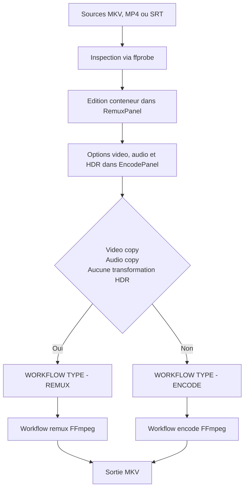
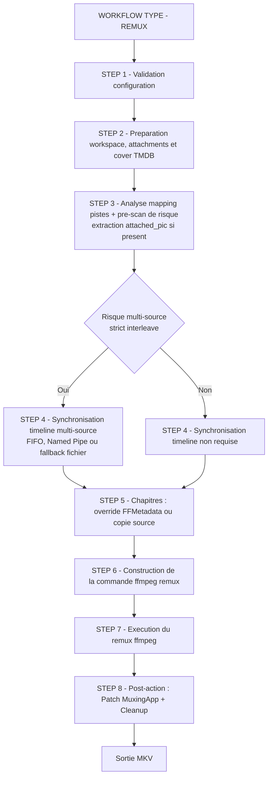
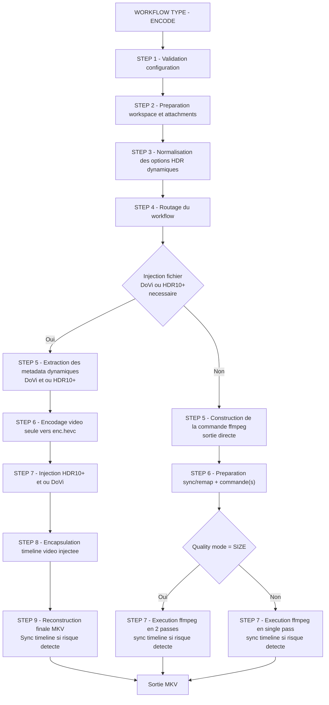
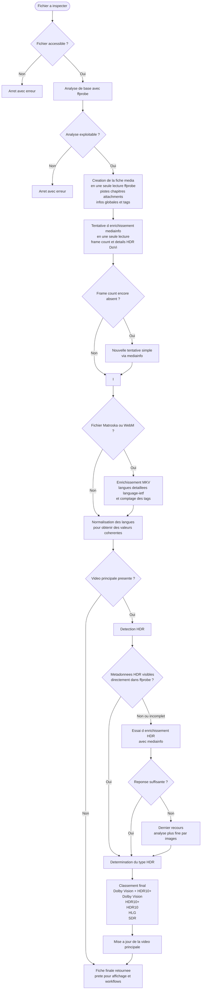

# 🎬 Mediarecode

FULL Vibecoded App for Proof of Concept - no human code, only human prompts and eyes.

Interface graphique pour préparer des fichiers vidéo, remuxer sans perte, réencoder avec `ffmpeg` (et `NVencC` en option pour NVidia), et fusionner des métadonnées Dolby Vision / HDR10+.

Cette documentation correspond à **Mediarecode v3.0.0**.

## Sommaire

- [Vue rapide](#vue-rapide)
- [Installation](#installation)
  - [Prérequis](#prérequis)
  - [Cloner le dépôt](#cloner-le-dépôt)
  - [Installer les dépendances et les outils](#installer-les-dépendances-et-les-outils)
  - [Lancer l'application](#lancer-lapplication)
- [Interface et usage](#interface-et-usage)
  - [Tableau de bord](#tableau-de-bord)
  - [Conteneur & Encodage](#conteneur--encodage)
  - [Profils](#profils)
  - [Fusion DoVi / HDR10+](#fusion-dovi--hdr10)
  - [Paramètres](#paramètres)
- [Thèmes](#thèmes)
- [Localisation](#localisation)
- [Configuration](#configuration)
  - [Priorité des réglages](#priorité-des-réglages)
  - [Paramètres principaux](#paramètres-principaux)
  - [Buffer RAM](#buffer-ram)
  - [Outils configurables](#outils-configurables)
- [Workflows](#workflows)
  - [Conteneur & Encodage — Routage global](#conteneur--encodage--routage-global)
  - [Backend remux `ffmpeg` — Branches internes](#backend-remux-ffmpeg--branches-internes)
  - [Encode workflow — Branches internes](#encode-workflow--branches-internes)
  - [Fusion DoVi / HDR10+](#fusion-dovi--hdr10-1)
  - [Inspection d'un fichier (ffprobe + mediainfo)](#inspection-dun-fichier-ffprobe--mediainfo)
- [Outils externes](#outils-externes)
- [Troubleshooting windows](#troubleshooting-windows)
  - [Windows Security / Controlled Folder Access](#windows-security--controlled-folder-access)

## Vue rapide

| Outil | Usage | Qualité |
|-------|-------|---------|
| **Conteneur & Encodage** | sélectionner les pistes, les réordonner, éditer langue/titre/flags, gérer titre/tags/chapitres/pièces jointes, enrichir les tags via TMDB/IMDb, puis copier ou réencoder | copie = sans perte, encodage = avec recompression |
| **Fusion DoVi / HDR10+** | injecter les métadonnées HDR d'un fichier source dans le flux vidéo HEVC d'un autre fichier | sans perte |

> Les panneaux **Remuxage** et **Encodage** forment un seul workflow. Le panneau Remuxage prépare le conteneur ; le panneau Encodage décide comment traiter la vidéo et l'audio.

**Drag-and-drop global** : n'importe quel fichier média peut être déposé directement sur la fenêtre principale, quelle que soit la page active. Les formats sources supportés sont centralisés dans `core/file_types.py` (MKV, MP4, MOV, M4V, AVI, TS, M2TS, WEBM, HEVC brut, SRT, etc.).

**Ouverture système** : l'application se déclare comme candidate dans les menus "Ouvrir avec..." sur Linux (AppImage), Windows (.exe) et macOS (.app), sans devenir l'application par défaut. Quand elle est lancée avec un fichier, celui-ci est chargé automatiquement comme source.

## Installation

### Prérequis

- **Python 3.10+**

`setup.py` installe ensuite **tous les autres prérequis** pour **Windows**, **Linux Fedora / RHEL**, **Linux Debian / Ubuntu** et **macOS**, y compris **PySide6** et les outils externes nécessaires.

### Installation avec binaires (recommandée)

Depuis les releases, récupérer le binaire associé à votre OS.

AppImage Linux : un gestionnaire type Gear Lever est recommandé pour maintenir les applications à jour. 
L'appimage AllInc inclue toutes les dépendances.

| Cible | Binaire | 
|-------|----------|
| AppImage Linux | Mediarecode-x86_64_allinc-<version>.AppImage` + `dist/releases/Mediarecode-x86_64_allinc-<version>.AppImage.zsync` |
| Package macOS natif | `Mediarecode-<version>.dmg` |
| Installateur Windows | `dist/releases/Mediarecode-Setup-<version>.exe` |
| Release Homebrew Linux/macOS (preview)| `brew tap Hydro74000/mediarecode && brew install mediarecode` |


### Cloner le dépôt

```bash
git clone <url-du-depot>
cd mediarecode
```

### Installer les dépendances et les outils

Le script `setup.py` installe automatiquement :

| Catégorie | Installé par `setup.py` |
|-----------|-------------------------|
| Dépendance Python | `PySide6` |
| Outils système | `ffmpeg`, `ffprobe`, `mediainfo` |
| Outils GitHub | `dovi_tool`, `hdr10plus_tool` |
| Notes plateforme | Debian/Ubuntu via `apt`, Fedora/RHEL via `dnf`, macOS via Homebrew, Windows via `winget` + binaires locaux |

> `setup.py` renseigne `config.ini` avec les chemins détectés.  
> Emplacement de `config.ini` : Linux/macOS `~/.config/mediarecode/config.ini` (XDG), Windows dev `./config.ini`, Windows packagé `%APPDATA%\mediarecode\config.ini`.

| Plateforme | Commande | Détails |
|------------|----------|---------|
| Linux Debian / Ubuntu | `python3 setup.py` | installe `ffmpeg`, `mediainfo` via `apt`, puis `dovi_tool` et `hdr10plus_tool` depuis GitHub |
| Linux Fedora / RHEL | `python3 setup.py` | active RPM Fusion si nécessaire, installe `ffmpeg`, `mediainfo` via `dnf`, puis les outils GitHub |
| macOS | `python3 setup.py` | installe `ffmpeg`, `mediainfo` via Homebrew, puis `dovi_tool` et `hdr10plus_tool` |
| Windows | `py setup.py` | installe `ffmpeg` et `mediainfo` via `winget`, place `dovi_tool` et `hdr10plus_tool` dans `mediarecode\tools`, puis renseigne `config.ini` avec les chemins détectés |

Options utiles du script :

| Option | Effet |
|--------|-------|
| `--dry-run` | affiche les actions sans les exécuter |
| `--no-github` | n'installe pas `dovi_tool` ni `hdr10plus_tool` |
| `--prefix PATH` | change le dossier d'installation des binaires GitHub |
| `--force` | relance les installations et régénère les chemins Windows dans `config.ini` |

`eac3to` est optionnel et non installable automatiquement. Il reste utile sous Windows pour certains traitements audio avancés.

### Lancer l'application

```bash
python3 main.py
```

Sous Windows, utilisez `py main.py`.

### Installation via Homebrew

Une distribution Homebrew est prévue pour Linux et macOS via le tap `Hydro74000/mediarecode`.

```bash
brew tap Hydro74000/mediarecode
brew install mediarecode
```

Sur Linux, la formule installe l’AppImage all-inclusive. Sur macOS, elle installe `Mediarecode.app`, déclare `ffmpeg` et `mediainfo` comme dépendances Homebrew, et embarque `dovi_tool` / `hdr10plus_tool`.

## Interface et usage

### Tableau de bord

Le tableau de bord affiche :

- l'état des outils externes détectés
- les dossiers configurés (travail, sortie, app data)
- les encodeurs logiciels vus par `ffmpeg -encoders`
- les encodeurs matériels réellement testés au runtime (`NVENC`, `AMF`, `VAAPI`, `QSV`)
- les plans d'encodage et badges utiles pour visualiser plus clairement les traitements prepares

> Les encodeurs matériels ne sont pas marqués disponibles simplement parce qu'ils apparaissent dans `ffmpeg`. L'application lance un probe réel pour confirmer qu'ils fonctionnent. Les probes sont exécutés en parallèle pour minimiser le délai au démarrage.

### Conteneur & Encodage

Le workflow unifié permet de :

- ajouter une ou plusieurs sources MKV / MP4 / SRT
- inspecter vidéo, audio, sous-titres, chapitres, pièces jointes et tags MKV
- activer, exclure et réordonner les pistes
- éditer langue, titre et flags de chaque piste
- créer des variantes audio indépendantes depuis l'onglet Encodage, sans modifier la piste d'origine
- réordonner ou supprimer ces variantes sans perdre leur lien avec le workflow
- visualiser dans le panel remux le codec et le bitrate cibles lorsqu'une piste audio sera réencodée
- extraire une piste de sous-titre depuis le menu contextuel du tableau des pistes
- synchroniser automatiquement une piste audio multi-source par analyse du contenu audio, avec choix d'une piste de référence et application directe du décalage calculé
- définir le titre du conteneur, les balises globales, les chapitres et les pièces jointes
- ouvrir une fenêtre de recherche **TMDB** depuis le panneau balises pour rechercher film/série (préremplissage auto depuis titre/nom de fichier)
- détecter automatiquement les motifs de série (`SxxExx`, `x`) pour préremplir saison/épisode et positionner la recherche sur **Séries** si pertinent
- injecter les métadonnées TMDB dans les tags MKV (`DATE_RELEASED`, `GENRE`, `DIRECTOR`, `CAST`, `SUBTITLE`, `SYNOPSIS`, `COUNTRY`, `URL`, `DESCRIPTION`, `COLLECTION`, `SEASON`, `EPISODE`)
- préparer une cover TMDB en mode différé (URL + nom de fichier) ; le téléchargement réel est fait au lancement du workflow
- remplacer automatiquement le **titre du conteneur** par le titre formaté TMDB lors de la validation (film : `Titre (Année)`, série : `Titre - SxxExx - Titre épisode`)
- choisir pour chaque piste audio un mode `copy`, `aac`, `eac3` ou `flac`
- definir plusieurs traitements video lorsqu'un projet demande une preparation multi-pistes plus fine
- choisir pour la vidéo `copy`, `libx265`, `libx264`, `libsvtav1`, `NVENC`, `AMF`, `VAAPI` ou `QSV` — avec support complet **HEVC**, **H.264** et **AV1** sur chaque famille matérielle
- presets dédiés par famille matérielle : `NVENC_PRESETS` (p1-p7 + slow/medium/fast/hp/hq), `VAAPI_PRESETS` (compression_level 0-7), `QSV_PRESETS` (veryslow → veryfast), `AMF_PRESETS` (quality/balanced/speed)
- **offload matériel complet** : décodage GPU activé automatiquement quand un encodeur matériel compatible est sélectionné (`cuda` pour NVENC, `qsv` pour QSV, `vaapi` pour VAAPI, `d3d11va` pour AMF Windows) — le CPU n'est plus sollicité pour le décodage en chemin pur hardware
- configuration VAAPI optimisée : `rc_mode CQP/VBR` selon le mode qualité, `compression_level` exposé via preset, `async_depth 4` pour maximiser le pipeline GPU
- precheck `force-8bit` pour les cibles **H.264** afin d'eviter certains chemins incompatibles
- backend de remux nominal : `ffmpeg`

Modes d'exécution :

| Condition | Mode | Outils utilisés |
|-----------|------|-----------------|
| vidéo en `copy`, audio en `copy`, aucune transformation HDR | **Remuxage pur** | `ffmpeg` (langues BCP47 via tag `language`, purge `language-ietf`, chapitres, tags globaux, pièces jointes, champ `Muxing Application`) |
| tout autre cas | **Encodage** | `ffmpeg` en passe de sortie unique (encodage/remux final + chapitres, tags, langue/titre de pistes, `Muxing Application`) |

Les fichiers **SRT** peuvent être ajoutés comme sources séparées de sous-titres. Ils sont détectés automatiquement et intégrés dans le remux final avec le format correct (`srt`).

Synchronisation audio automatisée en multi-source :

- disponible lorsqu'un projet contient des pistes audio issues d'au moins deux sources différentes
- pensée pour aligner une piste audio cible sur une source de référence, par exemple VF/VO provenant d'un autre fichier, autre édition, autre plateforme ou autre remux
- accessible depuis le bouton de synchronisation dans la ligne d'une piste audio ; Mediarecode propose alors les pistes 5.1/7.1 compatibles des autres sources comme références
- analyse le contenu réel avec `ffmpeg` / `ffprobe`, extrait une signature depuis les canaux surround/LFE, détecte les moments clés communs entre la piste cible et les pistes de la source de référence, puis applique automatiquement l'offset signé en millisecondes
- affiche l'offset dans la colonne Info (`Δt +125 ms`, `Δt -320 ms`, etc.) et conserve cette valeur dans la configuration de remux
- remet la piste de référence à `0 ms` quand un offset est appliqué à la cible, afin de garder une seule piste déplacée et une timeline plus lisible
- échoue volontairement si la piste est trop courte, si la corrélation est trop faible, ou si les canaux disponibles ne permettent pas une analyse fiable

Cette synchronisation audio est un outil utilisateur pour **calculer le bon décalage entre sources**. Elle complète la synchronisation timeline interne du backend `ffmpeg`, qui intervient plus tard pendant l'exécution pour sécuriser le muxage multi-source et les offsets déjà définis.

Backend remux `ffmpeg` (par défaut) :

- sortie limitée à `MKV`
- écrit la langue de piste en BCP47 sur `language` (ex. `fr-FR`) et purge le champ legacy `language-ietf` pour éviter les doublons incohérents
- corrige au besoin les tags de langue Matroska en post-action, sans repasser par MKVToolNix
- permet la recopie ou l'édition des chapitres
- permet d'écrire les tags globaux choisis
- permet de recopier les pièces jointes source sélectionnées et d'ajouter des fichiers externes (cover incluse)
- peut générer un fichier `.nfo` MediaInfo à côté du MKV final après un remux ou un encodage réussi
- télécharge la cover TMDB différée juste avant l'exécution (dans le dossier temporaire du process), puis nettoie ce dossier en fin de run
- purge explicitement les balises techniques source `ENCODER` et `CREATION_TIME` avant écriture des métadonnées de sortie
- n'écrit plus le tag libre `MUXING_APPLICATION` via `-metadata`
- applique un patch binaire post-action (sans MKVToolNix) sur le header Matroska pour écrire **MuxingApp** (`0x4D80`) à la valeur unique `Mediarecode {version}` ; **WritingApp** (`0x5741`) reste intact

Limites connues du backend remux `ffmpeg` :

- pas de support des structures XML avancées de tags Matroska (cibles hiérarchiques fines)
- pas d'édition du flag Matroska `track-enabled` (non exposé par FFmpeg)
- la réécriture post-action reconstruit l'EBML du header si la valeur MuxingApp est plus longue que le champ existant ; en cas d'échec, le patch est ignoré avec warning

Les options HDR disponibles côté encodage sont :

- injection de métadonnées HDR10 statiques
- tone mapping HDR vers SDR
- copie DoVi / HDR10+ depuis la source avec workflow multi-étapes

Ergonomie du panneau :

- aperçu **cover** cliquable avec modale zoom plein écran (cover TMDB, cover Matroska extraite via `core/matroska_attachment_extractor.py`, pièces jointes image)
- **barre de progression à rattrapage exact** : tant que `ffmpeg -progress` n'émet pas encore `out_time`, la progression est estimée via `frame=` et le nombre total d'images du fichier source ; dès que `out_time` devient disponible, la valeur exacte prend le relais
- progression "la plus lente" pour les preparations video multi-pistes, avec suivi plus detaille par traitement disponible
- **suppression de source accélérée** via suivi incrémental (pas de rescan global à chaque retrait)
- covers TMDB cliquables dans les résultats de recherche (aperçu grand format avant validation)

### Profils

Les profils permettent de réutiliser un traitement sans devoir refaire les mêmes choix à la main sur chaque fichier. Mediarecode distingue deux usages.

| Besoin | Format | Usage |
|--------|--------|-------|
| Refaire exactement un traitement | `exact-job` | CLI, preview, run, batch strict |
| Réappliquer des décisions à d'autres sources | `decision-profile` | GUI low-code, CLI `--profile`, batch par dossier |

Un **exact job** contient sources, sortie et sélecteurs stricts. Il est adapté aux épisodes ou fichiers construits de la même façon.  
Un **decision profile** ne contient ni source ni sortie : il décrit comment retrouver, choisir, renommer et ordonner les pistes sur d'autres fichiers.

#### Profils décisionnels

Un profil décisionnel `version: 1` peut couvrir :

- sélection vidéo au plus proche : résolution, HDR, HDR10, HDR10+, Dolby Vision, HLG
- sélection audio et sous-titres par type, langue, codec, canaux, titre, flags
- renommage des titres de pistes par keywords
- flags MKV : défaut, forcé, malentendant, malvoyant, original, commentaire
- ordre des pistes
- tags temporaires de pistes pour chaîner des règles
- création de variantes audio, par exemple une compatibilité AC3 depuis une piste TrueHD

Les profils GUI sont enregistrés ici :

```text
<dossier de config Mediarecode>/profiles/decision/
```

#### Éditeur low-code

Dans le panneau Remux, **Éditer profil** ouvre une fenêtre dédiée :

- panneau gauche : groupes et règles
- panneau central : critères, actions, priorité, mode d'écriture, tags, patterns
- panneau droit : preview piste par piste
- bouton **Insérer keyword** : menu par catégories pour remplir le champ actif sans afficher toute la liste en permanence
- clic droit dans un champ compatible : entrée **Insérer keyword** avec les mêmes catégories
- keywords affichés comme badges lorsque le champ n'est pas en cours d'édition
- critères obligatoires ou préférés : un préféré donne un bonus de priorité sans bloquer le fallback
- sélecteur pour charger un profil existant, l'éditer ou le supprimer après confirmation

Deux départs sont possibles :

- **Profil vide** : construire les règles à la main
- **Capturer l'état courant** : partir de la table de pistes actuelle puis ajuster

Les modèles disponibles couvrent les usages principaux : sélection vidéo, garder une langue, exclure commentaire, renommer, flags, ordre, variante audio et tag temporaire.

#### Comprendre une règle

Une règle répond toujours à trois questions :

- **Quelles pistes regarder ?** Ce sont les critères : type, langue, codec, titre, flags, largeur, hauteur, HDR, Dolby Vision, etc.
- **Combien de pistes appliquer ?** C'est la **portée** : `best`, `first` ou `all`.
- **Que faire sur ces pistes ?** Ce sont les actions : activer, désactiver, renommer, changer la langue, écrire des flags, créer une variante audio, ou donner une priorité d'ordre.

Un critère peut être **obligatoire** ou **préféré**.

- **Obligatoire** : si la piste ne respecte pas ce critère, elle est exclue.
- **Préféré** : la piste peut quand même être choisie, mais celle qui respecte le critère marque plus de points.

Exemple : pour une piste audio française en EAC3, avec Atmos si disponible :

- langue `fr-FR` : obligatoire
- codec `EAC3` : obligatoire
- keyword préféré `{atmos}` : bonus si une piste Atmos existe

Si aucune piste Atmos n'existe, Mediarecode peut quand même garder la meilleure piste française EAC3.

#### Portée des règles

La portée détermine combien de pistes une règle va modifier.

| Portée | Effet | Usage typique |
|--------|-------|---------------|
| `best` | choisit la piste qui a le meilleur score | choisir une seule vidéo, une seule VF principale, une seule VO principale |
| `first` | choisit la première piste compatible dans l'ordre des sources | faire confiance à l'ordre du fichier source |
| `all` | applique la règle à toutes les pistes compatibles | renommer toutes les pistes audio, désactiver tous les commentaires, tagger tous les sous-titres forcés |

`best` est le choix le plus courant pour une sélection intelligente. Le moteur additionne les points des critères compatibles : langue, codec, canaux, Atmos/DTS:X, flags, résolution, HDR, etc. S'il y a une égalité impossible à départager, le GUI le signale dans l'aperçu. Pour la vidéo, si plusieurs pistes ont exactement le même score, Mediarecode garde la première source/index.

`first` est plus simple : il prend la première piste compatible. C'est pratique quand les fichiers sont toujours construits pareil, par exemple “prendre la première audio française”.

`all` est fait pour les actions de masse. Exemple : “renommer toutes les pistes audio avec `{lang_name} {codec} {channels}`” ou “désactiver toutes les pistes dont le titre contient commentary”.

#### Écriture et conflits

Si deux règles écrivent le même champ d'une même piste, Mediarecode utilise le **mode d'écriture** de la règle :

- **Priorité** : mode recommandé. La règle la plus prioritaire gagne pour le champ concerné. Les autres règles peuvent toujours écrire d'autres champs.
- **Remplacer** : la règle écrase la valeur déjà proposée, même si une règle plus prioritaire est passée avant.
- **Compléter** : la règle n'écrase pas la valeur déjà proposée. Pour un titre, elle ajoute le fragment rendu au titre déjà construit.

Une égalité de priorité avec deux valeurs différentes reste un conflit : le GUI le signale, et la CLI bloque avec un rapport JSON.

Dans l'éditeur, le nombre **Priorité** sert aussi à savoir quelle règle passe avant une autre. **Plus le nombre est grand, plus la règle est prioritaire** : `999` passe avant `1`.

Le moteur trie les règles du plus grand au plus petit. Si vous utilisez les groupes, la priorité du groupe compte d'abord, puis la priorité de la règle :

```text
priorité effective = priorité du groupe, puis priorité de la règle
```

Par exemple, une règle priorité `1` dans un groupe priorité `300` passe avant une règle priorité `999` dans un groupe priorité `200`, car le groupe est plus prioritaire.

En mode **Priorité**, le plus grand gagne aussi pour les conflits d'écriture. Une règle priorité `999` peut écrire un titre en premier ; si une règle priorité `1` passe ensuite et propose un autre titre en mode **Priorité**, elle ne remplace pas le titre déjà choisi. Les boutons de déplacement des règles ajustent cette priorité.

Le mode **Remplacer** est différent : c'est un choix volontaire pour forcer une exception. Une règle moins prioritaire en mode **Remplacer** peut donc écraser une valeur écrite par une règle plus prioritaire.

Exemple :

- règle A, priorité 100 : titre = `French DDP 5.1`
- règle B, priorité 50 : titre = `VF`
- en mode **Priorité**, le titre reste `French DDP 5.1`
- en mode **Remplacer** sur la règle B, le titre devient `VF`
- en mode **Compléter** sur la règle B, le titre devient `French DDP 5.1 VF`

La priorité règle donc l'ordre d'évaluation et les écritures concurrentes. Elle ne déplace pas les pistes à elle seule.

#### Ordonner les pistes

L'ordre de sortie se règle avec le modèle/action **Ordre**. Cette action donne une priorité d'ordre à la piste matchée :

- plus la valeur est haute, plus la piste remonte
- les pistes sans priorité d'ordre gardent leur ordre relatif
- si deux pistes ont la même priorité d'ordre, leur ordre relatif reste stable

Une façon simple de construire un profil d'ordre :

| Règle | Portée | Critères | Action d'ordre |
|-------|--------|----------|----------------|
| Vidéo principale | `best` | type vidéo, 2160p/HDR/Dolby Vision préférés | `1000` |
| Audio FR principale | `best` | langue `fr-FR`, codec voulu, Atmos préféré | `800` |
| Audio VO principale | `best` | langue `en-US`, codec voulu, Atmos préféré | `700` |
| Sous-titres FR forcés | `all` | langue `fr-FR`, flag forced | `400` |
| Sous-titres FR complets | `best` | langue `fr-FR`, non forced | `300` |

Pour ordonner proprement, séparez souvent les intentions :

- une règle choisit ou désactive les pistes
- une règle renomme les titres
- une règle donne les priorités d'ordre

Ce découpage rend l'aperçu plus lisible et évite qu'une règle fasse trop de choses à la fois.

#### Keywords

Les keywords servent à trois choses :

- renommer une piste avec un pattern de titre
- identifier une piste dans les critères du profil, par exemple `{flag_visual_impaired}` ou `{codec_atmos}`
- compléter certains champs d'action, par exemple garder la langue courante avec `{language}`

#### Variables

Un profil peut contenir des variables éditables. Le premier usage disponible dans l'éditeur est **Aliases codecs**, accessible par un bouton dans l'éditeur :

```text
EAC3=DDP
AC3=Dolby Digital
TRUEHD=Dolby TrueHD
```

Ensuite :

- dans les patterns de titre, `{codec}` et `{codec_name}` affichent l'alias friendly, par exemple `DDP`
- `{codec_raw}` garde toujours le nom technique, par exemple `EAC3`
- si aucun alias n'existe, `{codec}` et `{codec_name}` retombent sur le codec technique

Exemple de pattern :

```text
{lang_name} {codec} {channels}
```

Avec `EAC3=DDP`, le titre devient `French DDP 5.1`.

Une action de titre peut utiliser un pattern :

```text
{lang_name} {codec} {channels} {audio_object}
```

Exemples :

- `VF {codec} {channels}` -> `VF DDP 5.1` si `EAC3=DDP`, sinon `VF EAC3 5.1`
- `{lang_name} {codec} {channels} {flag_forced}` -> `French PGS Forced`
- `{lang_name} {codec_raw} {channels} {audio_object}` -> `French EAC3 5.1 Atmos`

Si une valeur manque, Mediarecode l'omet et nettoie les espaces ou séparateurs inutiles.

Keywords disponibles au premier lot :

```text
{type} {source_index} {track_index}
{language} {lang} {lang_name}
{title} {source_title}
{codec} {codec_raw} {codec_name} {channels} {channel_layout} {audio_object}
{atmos} {dtsx} {codec_atmos} {codec_dtsx}
{resolution} {width} {height} {hdr} {video_flags_hex}
{video_hdr} {video_hdr10} {video_hdr10plus}
{video_dolby_vision} {video_hlg} {video_sdr}
{flags} {flag_enabled} {flag_default} {flag_forced}
{flag_hearing_impaired} {flag_visual_impaired}
{flag_original} {flag_commentary}
```

Pour la vidéo, `width` et `height` sont indépendants : vous pouvez renseigner seulement la largeur, seulement la hauteur, les deux, ou aucun des deux. La profondeur couleur, quand elle est détectée, est prise en compte dans les caractéristiques techniques internes (`video_flags_hex`) mais n'a pas de champ dédié dans l'éditeur simple.

Exemple : pour garder une piste audio française en EAC3 et préférer Atmos si elle existe, indiquez `fr-FR` en langue, `EAC3` en codec avec **Obligatoire**, puis `{atmos}` dans **Keywords préférés**.

#### Application

Depuis le GUI, **Appliquer profil** charge un profil enregistré, affiche un aperçu, puis applique après confirmation.

En CLI :

```bash
mediarecode-cli validate --profile profil.json
mediarecode-cli preview --profile profil.json -i source.mkv --json
mediarecode-cli run --profile profil.json -i source.mkv -o sortie.mkv
```

Vous pouvez donner un chemin complet ou simplement le nom d'un profil sauvegardé dans le dossier utilisateur. L'extension `.json` est optionnelle : `--profile BestOfAll` cherchera aussi `BestOfAll.json` dans `<dossier de config Mediarecode>/profiles/decision/`.

En batch dossier :

```bash
mediarecode-cli batch \
  --profile profil.json \
  --input-dir "Serie" \
  --recursive \
  --output-dir "out" \
  --auto-tmdb \
  --dry-run
```

`--auto-tmdb` peut être ajouté aux traitements CLI pour récupérer les tags TMDB et la cover. La CLI déduit automatiquement saison/épisode depuis les noms de fichiers du type `S01E02` ou `01x02`. Utilisez `--tmdb-id` pour forcer une fiche, `--no-cover` pour garder les tags sans cover, et `--no-attach` pour ne sortir aucun attachment.

La CLI n'ouvre pas de dialogue interactif. Si un conflit ou une ambiguïté ne peut pas être résolu automatiquement, elle retourne un rapport JSON et bloque l'application.

#### Exact jobs

**Exporter JSON CLI** produit un job exact destiné aux traitements stricts.

Il est adapté aux épisodes ou fichiers construits de la même façon :

```bash
mediarecode-cli validate --config exact-job.json
mediarecode-cli preview --config exact-job.json
mediarecode-cli run --config exact-job.json
mediarecode-cli batch --template exact-job.json --input-dir "Serie" --output-dir "out"
```

Utilisez un exact job quand la structure des sources est stable. Utilisez un profil décisionnel quand les sources varient mais que vos décisions restent les mêmes.

### Fusion DoVi / HDR10+

Ce panneau prend :

- **Film 1** : la vidéo cible à enrichir (`.mkv` ou `.hevc`)
- **Film 2** : la source HDR contenant Dolby Vision et/ou HDR10+ (`.mkv` ou `.hevc`)

Règles importantes :

- Film 1 et Film 2 doivent contenir de la **vidéo HEVC**
- Film 2 doit contenir **Dolby Vision** et/ou **HDR10+**
- l'écart de frame count doit être **<= 4 images**
- le remux final conserve l'audio et les sous-titres de Film 1

Le workflow UI Fusion DoVi/HDR10+ est désormais **FFmpeg-only** pour l'extraction HEVC et le remux final (plus de dépendance MKVToolNix dans ce panneau).

Profils Dolby Vision proposés :

| Profil | Effet |
|--------|-------|
| **Profile 8.1** | normalise l'injection en profil 8.1, recommandé pour les remux UHD |
| **Mode 0** | conserve le profil source sans réécriture |

### Paramètres

Le panneau **Paramètres** est un éditeur complet de `config.ini` intégré à l'interface. Il regroupe :

- **Interface** : thème (`dark` / `light`), langue, nombre maximal de lignes de log, panneau affiché au démarrage
- **Chemins** : dossier de travail, dossier de sortie, dossier app data
- **Remux** : backend `ffmpeg` (nominal)
- **Outils externes** : chemins explicites pour chaque outil (`ffmpeg`, `ffprobe`, `mediainfo`, `dovi_tool`, `hdr10plus_tool`, etc.)
- **Encodage** : profil DoVi, compat-id, buffer RAM
- **Logs** : niveau de verbosite, journal fichier, rotation et capture des sorties outils dans les options
- **Métadonnées** : auth TMDB via clé API v3 (`tmdb_api_key`) ou token Bearer v4 (`tmdb_bearer_token`), génération optionnelle de `.nfo` (`generate_nfo`)

Les changements sont appliqués section par section ou en une seule fois via le bouton **Sauvegarder toute la configuration**. Un rechargement depuis `config.ini` est possible sans redémarrer l'application.

## Thèmes

L'application supporte deux thèmes visuels, sélectionnables dans le panneau Paramètres :

| Thème | Description |
|-------|-------------|
| `dark` (défaut) | fond sombre, accents bleus |
| `light` | fond clair, contrastes adaptés |

Le changement de thème est appliqué immédiatement sans redémarrage.

## Localisation

L'interface est traduite en **français** et **anglais**. La langue active est détectée automatiquement depuis la locale système au premier lancement, puis peut être modifiée dans le panneau Paramètres.

Les textes de l'application sont centralisés dans `locales.json`.

Les tags de langue saisis (pistes audio, sous-titres) utilisent des codes RFC 5646 / BCP47 (ex. `fr`, `fr-FR`, `en-US`). Les libellés non standards comme `French` ne sont pas acceptés.

## Configuration

### Priorité des réglages

L'application résout ses paramètres dans cet ordre :

1. `config.ini` (Linux/macOS : `~/.config/mediarecode/config.ini` ; Windows dev : racine du projet ; Windows packagé : `%APPDATA%\mediarecode\config.ini`)
2. les valeurs persistées par l'interface (`QSettings`)
3. les valeurs par défaut internes

Sous Windows, `setup.py` et le démarrage de l'application peuvent auto-détecter les outils et renseigner automatiquement la section `[tools]` de `config.ini`.

### Paramètres principaux

| Paramètre | Défaut | Description |
|-----------|--------|-------------|
| `work_dir` | `/tmp/mediarecode_work` sur Linux/macOS, `%TEMP%\mediarecode_work` sur Windows | dossier des fichiers temporaires |
| `output_dir` | dossier Vidéos de l'OS | dossier de sortie par défaut |
| `theme` | `dark` | thème visuel (`dark` ou `light`) |
| `language` | auto-détecté | langue de l'interface (`fra` ou `eng`) |
| `startup_panel` | `dashboard` | panneau ouvert au démarrage (`dashboard`, `container`, `encoding`, `dovi`, `settings`) |
| `backend` (section `[remux]`) | `ffmpeg` | backend de remux (`ffmpeg`) |
| `tmdb_api_key` | vide | clé API TMDB v3 utilisée par la recherche IMDb/TMDB |
| `tmdb_bearer_token` | vide | token Bearer TMDB v4 (utilisé si `tmdb_api_key` est vide, ou via `MEDIARECODE_TMDB_BEARER_TOKEN`) |
| `generate_nfo` | `true` | génère un fichier `.nfo` MediaInfo à côté du MKV final après workflow réussi |
| `ram_buffer_enabled` | `true` | autorise l'usage de `/dev/shm` pour les HEVC intermédiaires si disponible |
| `ram_buffer_threshold_pct` | `15` | pourcentage minimal de RAM libre à conserver pour activer ce buffer |

### Buffer RAM

Le workflow d'encodage peut placer les fichiers HEVC temporaires en RAM pour limiter les E/S disque.

Conditions d'utilisation :

- `ram_buffer_enabled = true`
- un répertoire RAM-backed disponible et inscriptible (`/dev/shm`)
- après allocation estimée, la RAM libre reste au-dessus du seuil `ram_buffer_threshold_pct`

Comportement :

- si toutes les conditions sont remplies, les intermédiaires HEVC sont écrits en RAM
- sinon, fallback automatique vers le dossier temporaire sur disque (`work_dir` ou temporaire système)
- la décision est réévaluée à chaque allocation

Limite Windows :

- l'application ne s'appuie pas sur un backend RAM standard sur Windows
- le chemin par défaut reste donc disque pour garantir un comportement stable et compatible avec les outils externes (`ffmpeg`, `dovi_tool`, `hdr10plus_tool`) qui attendent des chemins de fichiers classiques

### Outils configurables

Vous pouvez définir explicitement dans `config.ini` :

- `ffmpeg`, `ffprobe`
- `mediainfo`
- `dovi_tool`, `hdr10plus_tool`
- `eac3to`

Exemple :

```ini
[paths]
output_dir = /mnt/nas/videos

[tools]
ffmpeg = /opt/ffmpeg/bin/ffmpeg
dovi_tool = /usr/local/bin/dovi_tool

[remux]
backend = ffmpeg

[ui]
theme = light
language = eng
startup_panel = container

[metadata]
tmdb_api_key = <VOTRE_CLE_API_TMDB_V3>
tmdb_bearer_token = <VOTRE_TOKEN_BEARER_TMDB_V4>
generate_nfo = true
```

## Workflows

### Conteneur & Encodage — Routage global



### Backend remux `ffmpeg` — Branches internes



### Encode workflow — Branches internes



Lecture rapide :
- Les demandes `copy_hdr10plus` et `copy_dv` sont evaluees apres normalisation source.
- L'injection "fichier" n'est requise que si une copie DoVi ou HDR10+ reste demandee et que la video n'est pas en `copy`.
- Si `codec=copy` avec injection desactivee, le workflow reste en sortie directe ffmpeg (STEP 5-7), y compris si l'audio est reencode.
- Le 2-pass n'existe que dans le chemin direct (`quality_mode=SIZE`, `codec!=copy`).
- Le chemin injection utilise `enc.hevc`, puis `enc_wrapped.mkv`, puis un remux final ffmpeg (STEP 5-9).
- La sync timeline multi-source est activee uniquement en cas de risque detecte par pre-scan ffprobe ; sinon le flux reste en chemin direct.
- En mode TMDB, la cover est resolue en URL lors de la recherche puis telechargee uniquement au lancement du workflow.

### Fusion DoVi / HDR10+


### Inspection d'un fichier (ffprobe + mediainfo)



| Fiche media produite par l inspection |
|---|
| **Identite generale** : chemin du fichier, format du conteneur, duree totale, taille, debit global, titre du conteneur, tags globaux utiles.<br><br>**Pistes video** : index, codec, resolution, framerate, profondeur de couleur, infos colorimetriques, type HDR detecte, details Dolby Vision si disponibles, langue, titre, duree, debit.<br><br>**Pistes audio** : index, codec, nombre de canaux, layout `stereo/5.1/7.1`, frequence d echantillonnage, debit, langue, titre, duree, indicateurs utiles comme Atmos ou DTS:X quand ils peuvent etre deduits.<br><br>**Pistes de sous-titres** : index, codec, langue, titre, drapeaux `forced` et `default`.<br><br>**Chapitres** : liste des chapitres avec position temporelle et nom.<br><br>**Attachments** : cover, polices et autres ressources embarquees avec nom, type MIME, taille si disponible, et indication `attached_pic` pour les images de couverture integrees comme flux video.<br><br>**Enrichissement MKV/WebM** : comptage des tags globaux, recuperation prioritaire des langues detaillees `language-ietf` quand elles existent, avec repli sur `language` sinon.<br><br>**Normalisation finale** : harmonisation des langues vers une forme plus coherente et exploitable dans l interface et les workflows suivants.<br><br>**Enrichissement optionnel via mediainfo** : frame count si disponible, confirmation ou enrichissement des metadonnees HDR, et details Dolby Vision supplementaires quand `ffprobe` ne les expose pas assez. |

## CLI headless

La branche `devel-cli` ajoute un point d entree sans interface graphique :

```bash
python3 mediarecode_cli.py --help
./mediarecode-cli --help
```

Sous-commandes disponibles :

| Commande | Usage |
|----------|-------|
| `inspect` | inspecte une ou plusieurs sources et sort du JSON |
| `inspect --config-template` | genere un template JSON de remux copiant tout |
| `validate` | valide un job/template JSON sans executer ffmpeg |
| `preview` | affiche la commande ffmpeg prevue |
| `remux` | execute un remux headless |
| `batch` | applique un template JSON a plusieurs entrees |

Exemples :

```bash
python3 mediarecode_cli.py remux -i source.mkv -o sortie.mkv
python3 mediarecode_cli.py preview --config docs/cli/middle.json
python3 mediarecode_cli.py remux --config docs/cli/middle.json --dry-run
python3 mediarecode_cli.py batch --template docs/cli/complexe-toutes-options-template.json --batch docs/cli/complexe-toutes-options-batch.json --force
```

Le CLI est non interactif : une sortie existante est refusee sauf `--force`. Les chemins d outils sont lus depuis `config.ini`, avec overrides `--ffmpeg`, `--ffprobe`, `--mediainfo`, `--work-dir` et `--threads`.

Les templates JSON peuvent selectionner les pistes par type, langue et flags d origine, normaliser les langues BCP-47/RFC5646, renommer les pistes via patterns, ajouter/importer des chapitres, demander TMDB et traiter un batch. Trois configs d exemple sont fournies dans `docs/cli/` : simple, middle et complexe toutes options.

Dans les artefacts packages, l'entree CLI route vers le même bundle que l'application : `mediarecode-cli` sur Linux/AppImage/macOS, `mediarecode-cli.exe` sur Windows, ou `mediarecode --cli ...` en fallback.

## Outils externes

| Outil | Rôle principal |
|-------|----------------|
| `ffprobe` | analyse des flux, chapitres et métadonnées |
| `mediainfo` | frame count et informations HDR fines |
| `ffmpeg` | encodage, remux, copie de flux, extraction de sous-titres, écriture metadata/chapitres/tags, patch binaire MuxingApp |
| `dovi_tool` | extraction, injection et vérification Dolby Vision |
| `hdr10plus_tool` | extraction et injection HDR10+ |
| `nvidia-smi` | fallback de détection NVENC sous Linux |

## Troubleshooting windows

Cette notice ne concerne que les lancement depuis Mediarecode.exe

Le lancement via python (py main.py) n'est pas concerné.

### Windows Security / Controlled Folder Access

Sous Windows, les bibliothèques utilisateur comme **Videos**, **Documents**, **Pictures** et dossiers similaires peuvent être protégées par **Windows Security** via **Controlled Folder Access**.

Quand cette protection est active, Mediarecode peut être empêché d'écrire directement dans ces dossiers, même si :

- le dossier existe ;
- vous pouvez y accéder manuellement depuis l'Explorateur ;
- le chemin affiché dans l'application est correct.

Symptômes fréquents :

- popup **Sécurité Windows** indiquant que `mediarecode.exe` ou un outil comme `ffmpeg.exe` a été bloqué ;
- erreur `No such file or directory` lors d'un export vers `Videos` ou `Documents` ;
- succès de l'export vers un autre dossier non protégé, comme `Desktop` ou `%TEMP%`.

Au premier setup Windows, Mediarecode peut proposer d'ajouter ses exécutables à l'allowlist de Windows Security afin de pouvoir enregistrer directement dans ces bibliothèques protégées. Cette exception concerne l'application elle-même et `ffmpeg`, l'outil qui écrit effectivement les fichiers de sortie.

Sans cette exception, les exports directs vers **Videos**, **Documents**, **Pictures**, etc. peuvent rester bloqués.

Si vous refusez l'exception ou si vous devez la configurer manuellement :

1. Ouvrez **Sécurité Windows**.
2. Allez dans **Protection contre les virus et menaces**.
3. Ouvrez **Protection contre les ransomwares** puis **Gérer la protection contre les ransomwares**.
4. Entrez dans **Autoriser une application via l'accès contrôlé aux dossiers**.
5. Ajoutez `mediarecode.exe`.
6. Si nécessaire, ajoutez aussi `ffmpeg.exe`.

Après ajout à l'allowlist, redémarrez Mediarecode avant de retester un export vers `Videos` ou `Documents`.

---

*Mediarecode v3.0.0*
