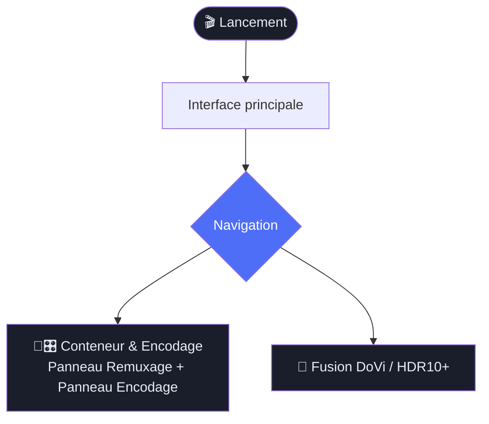
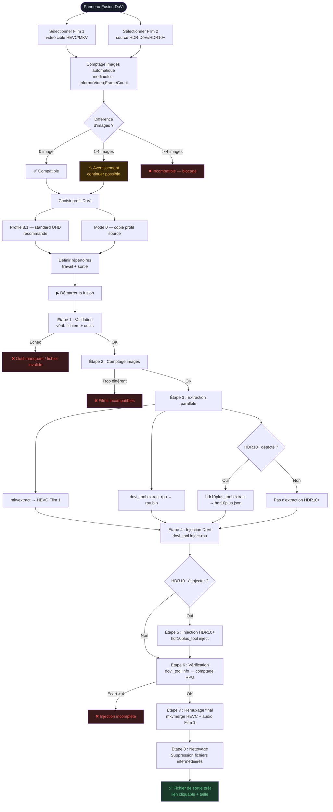
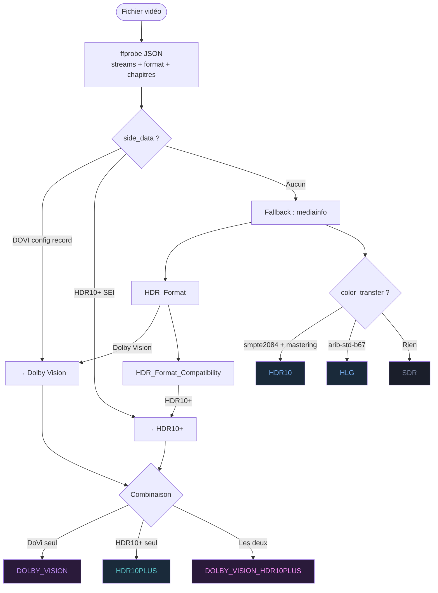

# 🎬 Mediarecode

Interface graphique pour le traitement avancé de fichiers vidéo MKV et MP4 — remuxage sans perte, injection de métadonnées HDR Dolby Vision / HDR10+, et encodage vidéo.

---

## 📋 Table des matières

- [À quoi ça sert ?](#-à-quoi-ça-sert-)
- [Installation](#️⃣-installation)
- [Interface générale](#️⃣-interface-générale)
- [Fonctionnalité 1 — Conteneur & Encodage](#-fonctionnalité-1--conteneur--encodage)
- [Fonctionnalité 2 — Fusion Dolby Vision / HDR10+](#-fonctionnalité-2--fusion-dolby-vision--hdr10)
- [Paramètres et configuration](#️-paramètres-et-configuration)
- [Schéma des workflows](#-schéma-des-workflows)

---

## 🤔 À quoi ça sert ?

Ce logiciel s'adresse aux personnes qui travaillent avec des fichiers vidéo haute qualité (films UHD 4K, Blu-ray numérisés, etc.) et qui ont besoin d'effectuer des opérations précises, avec ou sans recompression.

### Deux fonctionnalités principales

| Fonctionnalité | Description | Perd de la qualité ? |
|----------------|-------------|----------------------|
| **Conteneur & Encodage** | Sélectionner les pistes, les réorganiser, les renommer — puis soit les copier telles quelles, soit les réencoder | Dépend du mode (copie = non, encodage = oui) |
| **Fusion HDR** | Injecter les métadonnées Dolby Vision et/ou HDR10+ d'un fichier source dans un autre fichier | ❌ Non |

> **Note importante :** Les panneaux « Remuxage » et « Encodage » de l'interface ne sont **pas deux fonctionnalités séparées** — ils forment un **outil unique**. Le panneau Remuxage configure les pistes et la sortie ; le panneau Encodage configure le traitement vidéo/audio. Un seul bouton **Exécuter** lance l'opération, et l'outil décide automatiquement d'utiliser `ffmpeg` ou `mkvmerge` selon les réglages.

### Glossaire rapide pour débutant

| Terme | Explication simple |
|-------|--------------------|
| **MKV** | Format de conteneur vidéo (comme une boîte qui contient vidéo + audio + sous-titres) |
| **Remuxage** | Changer le contenu de la boîte sans retoucher la vidéo elle-même |
| **Piste** | Un flux dans le fichier : une piste vidéo, une piste audio, une piste de sous-titres |
| **HDR** | High Dynamic Range — image avec plus de luminosité et de couleurs qu'un écran standard |
| **Dolby Vision** | Format HDR propriétaire avec métadonnées dynamiques par image |
| **HDR10+** | Format HDR ouvert avec métadonnées dynamiques (Samsung, Amazon) |
| **RPU** | Les données Dolby Vision en binaire, séparées de la vidéo elle-même |
| **CRF** | Constante de qualité pour l'encodage : plus c'est bas, meilleure est la qualité |
| **Codec** | L'algorithme de compression vidéo : H.264, H.265 (HEVC), AV1… |
| **mkvpropedit** | Outil qui modifie les métadonnées d'un MKV sans le réencoder |

---

## 🛠️ Installation

### Prérequis système

- **Python 3.10+**
- **Git** (pour cloner le dépôt)

### Étape 1 — Cloner le dépôt

```bash
git clone <url-du-dépôt>
cd mediarecode
```

### Étape 2 — Lancer le script de setup

Le script `setup.py` installe automatiquement les dépendances Python et tous les outils externes selon la plateforme détectée.

#### Linux — Debian / Ubuntu

```bash
python3 setup.py
```

- Installe via `apt` : `ffmpeg`, `mkvtoolnix`, `mediainfo`
- Télécharge depuis GitHub : `dovi_tool`, `hdr10plus_tool`

#### Linux — Fedora / RHEL

```bash
python3 setup.py
```

- Active RPM Fusion Free automatiquement si nécessaire
- Installe via `dnf` : `ffmpeg`, `mkvtoolnix`, `mediainfo`
- Télécharge depuis GitHub : `dovi_tool`, `hdr10plus_tool`

#### macOS

```bash
python3 setup.py
```

- Installe via [Homebrew](https://brew.sh) : `ffmpeg`, `mkvtoolnix`, `mediainfo`
- Télécharge depuis GitHub : `dovi_tool`, `hdr10plus_tool` (binaire universel arm64 / x86_64)

> Homebrew doit être installé au préalable : https://brew.sh

#### Windows

```bash
python setup.py
```

- Installe via `winget` (Windows 10 1809+ / Windows 11) : `ffmpeg`, `mkvtoolnix`, `mediainfo`
- Télécharge depuis GitHub : `dovi_tool`, `hdr10plus_tool`
- Les binaires GitHub sont placés dans `%LOCALAPPDATA%\mediarecode\tools`

> Ajouter ce dossier au `PATH` : Paramètres → Système → Informations → Paramètres système avancés → Variables d'environnement

### Options du script

| Option | Effet |
|--------|-------|
| `--dry-run` | Affiche ce qui serait fait, sans rien exécuter |
| `--no-github` | Ignore le téléchargement de `dovi_tool` / `hdr10plus_tool` |
| `--prefix PATH` | Dossier d'installation pour les binaires GitHub (défaut : `/usr/local` sur Linux/macOS) |

### Outil optionnel (Windows uniquement)

`eac3to` — conversion audio avancée. Non installable automatiquement.
Télécharger manuellement : https://forum.doom9.org/showthread.php?t=125966

### Outils externes — récapitulatif

| Outil | Rôle | Requis pour |
|-------|------|-------------|
| `ffmpeg` | Encodage vidéo/audio, copie de flux, reconstruction finale | Conteneur & Encodage |
| `ffprobe` | Analyse des fichiers vidéo | Toutes les fonctions |
| `mkvmerge` | Remuxage pur et remuxage final HDR | Copie pure, Fusion HDR |
| `mkvextract` | Extraction de pistes | Fusion HDR |
| `mkvpropedit` | Modification des métadonnées post-encodage | Conteneur & Encodage |
| `mkvinfo` | Informations MKV | Analyse |
| `mediainfo` | Métadonnées et comptage d'images | Fusion HDR, Analyse |
| `dovi_tool` | Extraction / injection RPU Dolby Vision | Fusion HDR (DoVi) |
| `hdr10plus_tool` | Extraction / injection HDR10+ | Fusion HDR (HDR10+) |

> Les chemins vers ces outils sont configurables dans les **Paramètres** si ils ne sont pas dans le `PATH` système.

### Étape 3 — Lancer l'application

```bash
python3 main.py
```

---

## 🖥️ Interface générale

L'interface est divisée en trois zones :

```
┌──────────┬──────────────────────────────────────────┐
│          │                                          │
│  Barre   │         Zone principale                  │
│  de      │   (change selon l'onglet sélectionné)    │
│  naviga- │                                          │
│  tion    │                                          │
│          │                                          │
├──────────┴──────────────────────────────────────────┤
│              Journal de log (pliable)               │
└─────────────────────────────────────────────────────┘
```

### Barre de navigation (gauche)

| Bouton | Page |
|--------|------|
| Tableau de bord | Page d'accueil |
| Fusion DoVi | Injection Dolby Vision / HDR10+ |
| Encodage | Configuration codec/qualité vidéo et audio |
| Remuxage | Configuration des pistes et du conteneur |
| Paramètres | Configuration des outils et chemins |

### Journal de log (bas)

Le journal affiche en temps réel toutes les commandes et leur progression. Les messages sont colorés :

- 🔵 `INFO` — Information normale
- 🟢 `OK` — Succès
- 🟡 `WARN` — Avertissement
- 🔴 `ERROR` — Erreur

Le journal est pliable (cliquer sur l'en-tête). Sa hauteur maximale est configurable.

---

## 🔀 Fonctionnalité 1 — Conteneur & Encodage

### Vue d'ensemble

Les panneaux **Remuxage** et **Encodage** fonctionnent ensemble comme un seul outil. Ils sont connectés en temps réel :

- Le panneau **Remuxage** contrôle : quels fichiers sources, quelles pistes inclure, dans quel ordre, avec quels métadonnées, et le chemin de sortie.
- Le panneau **Encodage** contrôle : comment traiter la vidéo et l'audio (copie ou réencodage, codec, qualité, HDR).
- Le bouton **Exécuter** est unique et décide automatiquement du mode d'exécution.

### Comment l'outil décide du mode d'exécution

Quand vous cliquez sur **Exécuter**, l'outil inspecte la configuration :

| Condition | Mode | Outil utilisé |
|-----------|------|---------------|
| Vidéo en `copie` **ET** tous les audios en `copie` **ET** aucune injection HDR | **Remuxage pur** | `mkvmerge` |
| N'importe quel autre réglage (réencodage vidéo, audio, tone mapping, HDR…) | **Encodage** | `ffmpeg` + `mkvpropedit` |

> En mode **remuxage pur**, l'opération est instantanée et sans perte. En mode **encodage**, `ffmpeg` gère la totalité : vidéo, audio, sous-titres, pièces jointes et chapitres en une seule commande.

---

### Étape par étape

#### Panneau Remuxage — Configuration des pistes

##### 1. Ajouter des fichiers sources

Glisser-déposer un ou plusieurs fichiers MKV/MP4 dans la zone de liste des fichiers.
Chaque fichier est analysé automatiquement. Une couleur unique est attribuée à chaque source.

> Vous pouvez ajouter plusieurs sources pour combiner des pistes de fichiers différents (ex : vidéo d'un fichier, audio d'un autre).

##### 2. Inspecter un fichier (optionnel)

Cliquer sur le bouton **Inspecter** à côté d'un fichier pour voir le détail de ses pistes :
- **Vidéo** : codec, résolution, fréquence d'images, profondeur, type HDR
- **Audio** : codec, canaux, débit, indicateurs Atmos/DTS:X
- **Sous-titres** : codec, langue, drapeaux forcé/défaut
- **Chapitres** : liste des chapitres

##### 3. Sélectionner et ordonner les pistes

Le tableau des pistes liste toutes les pistes de tous les fichiers.

| Colonne | Description |
|---------|-------------|
| Type | V (vidéo), A (audio), S (sous-titres) |
| Codec | Le codec de la piste |
| Info | Résolution + HDR, canaux + débit selon le type |
| Langue | Code BCP-47 (ex : `fr`, `en-US`) |
| Titre | Nom de la piste |
| Activée | Case à cocher pour inclure/exclure la piste |

**Réordonner** : glisser-déposer les lignes pour changer l'ordre des pistes dans le fichier de sortie.
**Exclure** : décocher la case "Activée".

> Les pistes audio activées dans ce panneau sont automatiquement transmises au panneau Encodage, où elles peuvent être individuellement réencodées ou copiées.

##### 4. Modifier les métadonnées d'une piste

Double-cliquer sur une ligne ouvre un dialogue d'édition :

- **Langue** : code RFC 5646 (ex : `fr`, `en`, `ja`, `zh-Hans`) — validé en temps réel
- **Titre** : nom libre
- **Drapeaux** : Défaut, Forcé, Malentendant, Déficient visuel, Original, Commentaire

> Les modifications de langue et de titre faites dans le panneau Remuxage ou dans le panneau Encodage sont synchronisées dans les deux sens en temps réel.

##### 5. Options globales

- **Conserver les chapitres** : inclure ou non les chapitres dans le fichier de sortie
- **Sélectionner les pièces jointes** : si le fichier contient des attachements (ex : image de couverture), choisir lesquels inclure

##### 6. Chemin de sortie

Saisir ou sélectionner le chemin du fichier MKV de sortie. Ce chemin est partagé avec le panneau Encodage.

---

#### Panneau Encodage — Configuration du traitement

##### 7. Choisir le codec vidéo

Laisser sur **Copie** pour ne pas réencoder la vidéo. Sinon, choisir un codec :

**Logiciels (CPU)**

| Codec | Description |
|-------|-------------|
| `libx265` | x265 — HEVC, meilleure compression |
| `libx264` | x264 — H.264, compatibilité maximale |
| `libsvtav1` | SVT-AV1, compression excellente |

**Matériels (GPU) — détectés automatiquement**

| Codec | Description |
|-------|-------------|
| `hevc_nvenc` / `h264_nvenc` | GPU NVIDIA |
| `hevc_amf` / `h264_amf` | GPU AMD |
| `hevc_qsv` / `h264_qsv` | GPU Intel |

##### 8. Choisir le mode de qualité

| Mode | Description | Quand l'utiliser |
|------|-------------|-----------------|
| **CRF** — Qualité constante | Valeur 0 (parfait) à 51 (médiocre). Taille variable. | Usage standard recommandé |
| **Débit** — Bitrate fixe | Débit cible en kbps. Qualité variable. | Streaming, contrainte de débit |
| **Taille** — Taille cible | Taille finale en Mo. Encodage en 2 passes. | Contrainte de stockage précise |

##### 9. Choisir le preset

Le preset contrôle la vitesse d'encodage vs qualité :
- **x265/x264** : `ultrafast` → `placebo` (plus lent = meilleure compression)
- **SVT-AV1** : `0` (qualité max) → `12` (vitesse max)
- **NVENC** : `p1` (rapide) → `p7` (lent)

##### 10. Options HDR

**Injecter des métadonnées HDR statiques** : pour préserver les données HDR10 dans le fichier encodé.
- *Master Display* : calibration de l'écran maître (format `G(x,y)B(x,y)R(x,y)WP(x,y)L(max,min)`)
- *MaxCLL* : luminosité maximale (format `max,fall`)

**Tone map HDR → SDR** : pour convertir une source HDR en SDR compatible avec des écrans standards. Algorithmes : `hable`, `mobius`, `reinhard`, `gamma`, `linear`, `clip`.

**Copier DoVi / HDR10+ depuis la source** : si la source contient du Dolby Vision ou HDR10+, ces métadonnées peuvent être extraites et réinjectées dans la vidéo encodée (workflow en plusieurs étapes avec `dovi_tool` / `hdr10plus_tool`).

##### 11. Configurer les pistes audio

Les pistes audio viennent du panneau Remuxage. Pour chaque piste :

| Option | Description |
|--------|-------------|
| **Codec** | `copy` (sans réencodage), `aac`, `eac3`, `flac` |
| **Débit** | En kbps (pour aac et eac3) |
| **Extraire noyau TrueHD** | Supprime les données Atmos, garde le TrueHD de base |
| **Source distincte** | Permet d'associer une piste audio depuis un autre fichier |

##### 12. Gérer les profils d'encodage

- **Charger** un profil existant (préréglages sauvegardés)
- **Sauvegarder** les paramètres actuels comme nouveau profil
- **Supprimer** un profil personnalisé

##### 13. Aperçu de commande

La commande `ffmpeg` ou `mkvmerge` complète est affichée et mise à jour en temps réel.

##### 14. Exécuter

Cliquer sur le bouton **Exécuter l'opération**. La progression s'affiche dans le journal.

---

### Ce qui est lancé

#### Mode Remuxage pur (copie intégrale)

Utilisé quand tout est en copie et qu'aucune modification HDR n'est demandée.

```bash
mkvmerge -o SORTIE.mkv
  [--track-order 0:1,0:2,1:0]
  [--video-tracks 1]
  [--audio-tracks 2,3]
  [--no-subtitles]
  [--no-chapters]
  [--track-name 2:Français]
  [--language-ietf 2:fr]
  [--default-track-flag 2:1]
  SOURCE1.mkv [SOURCE2.mkv ...]
```

Suivi de `mkvpropedit` si des métadonnées de pistes doivent être modifiées.

#### Mode Encodage (ffmpeg)

Utilisé dès qu'un codec est actif, ou qu'un tone mapping / injection HDR est demandé.
`ffmpeg` gère tout en une seule commande : vidéo, audio, sous-titres, pièces jointes et chapitres.

```bash
ffmpeg -hide_banner -y
  -i SOURCE.mkv
  [-i SOURCE_AUDIO.mkv ...]          # si piste audio d'une autre source
  [-vf "zscale=...,tonemap=...,"]    # si tone mapping HDR→SDR
  -map 0:v:0
  -c:v libx265 -crf 20 -preset slow
  [-x265-params "master-display=...:max-cll=..."]
  [-color_primaries bt2020 -color_trc smpte2084 -colorspace bt2020nc]
  -map 0:a:0  -c:a:0 aac -b:a:0 384k
  -map 0:a:1  -c:a:1 copy
  [-bsf:a:0 truehd_core]             # si extraction noyau TrueHD
  -map 0:s:0 -c:s copy               # sous-titres depuis panneau remux
  -map 0:t:0 -c:t copy               # pièces jointes depuis panneau remux
  -map_chapters 0
  SORTIE.mkv
```

Suivi de `mkvpropedit` pour les métadonnées et balises MKV.

#### Mode Encodage avec copie DoVi / HDR10+ (workflow en plusieurs étapes)

Quand la source contient du Dolby Vision ou HDR10+ et que le codec n'est pas `copy`, `ffmpeg` ne peut pas propager les métadonnées HDR directement. L'encodage se fait alors en plusieurs étapes :

```bash
# 1. Extraction du flux HEVC brut de la source
ffmpeg -i SOURCE.mkv -map 0:v:0 -c:v copy -f hevc source.hevc

# 2. Extraction du RPU Dolby Vision (si présent)
dovi_tool extract-rpu -i source.hevc -o rpu.bin

# 3. Extraction des métadonnées HDR10+ (si présentes)
hdr10plus_tool extract source.hevc -o hdr10plus.json

# 4. Encodage vidéo (1 passe ou 2 passes selon le mode qualité)
ffmpeg [args] -an -f hevc encoded.hevc

# 5. Injection HDR10+ dans la vidéo encodée (si applicable)
hdr10plus_tool inject -i encoded.hevc -j hdr10plus.json -o encoded_hdr10p.hevc

# 6. Injection du RPU Dolby Vision (si applicable)
dovi_tool -m 0 inject-rpu -i encoded_hdr10p.hevc -r rpu.bin -o encoded_final.hevc

# 7. Reconstruction finale : HEVC enrichi + audio/sous-titres/pièces jointes
ffmpeg -hide_banner -y
  -i encoded_final.hevc
  -i SOURCE.mkv
  -map 0:v:0 -c:v copy
  -map 1:a:0 -c:a:0 aac -b:a:0 384k
  -map 1:s?  -c:s copy
  -map_chapters 1
  SORTIE.mkv

# 8. Post-traitement métadonnées
mkvpropedit SORTIE.mkv --edit track:@1 --set language-ietf=fra ...
```

---

## 💫 Fonctionnalité 2 — Fusion Dolby Vision / HDR10+

### Qu'est-ce que c'est ?

Certaines sources vidéo contiennent le contenu HDR (Dolby Vision, HDR10+) dans un fichier, et la vidéo de meilleure qualité dans un autre. Cette fonctionnalité permet d'**injecter les métadonnées HDR du Film 2 dans le flux vidéo HEVC du Film 1**, sans réencodage.

**Exemple d'usage :** Un encode x265 excellent (Film 1) auquel vous voulez ajouter les couches Dolby Vision venant d'un Blu-ray (Film 2).

### Concepts clés

| Terme | Explication |
|-------|-------------|
| **Film 1** | Le fichier cible — contient la vidéo HEVC à enrichir |
| **Film 2** | La source HDR — contient le RPU Dolby Vision et/ou les métadonnées HDR10+ |
| **RPU** | Reference Processing Unit — les données DoVi par image |
| **Profil 8.1** | Format DoVi standard pour UHD Blu-ray (recommandé) |
| **Mode 0** | Copie à l'identique du profil source sans modification |

### Prérequis

- Film 1 et Film 2 doivent avoir **le même nombre d'images** (tolérance : 4 images max)
- Film 2 doit contenir du Dolby Vision et/ou HDR10+
- Le flux vidéo doit être en **HEVC (H.265)**

### Étape par étape

#### 1. Sélectionner Film 1

Glisser-déposer ou sélectionner le fichier MKV cible (celui qui recevra les données HDR).

#### 2. Sélectionner Film 2

Glisser-déposer ou sélectionner le fichier source HDR (MKV ou HEVC brut).

#### 3. Vérification du nombre d'images

L'outil compare automatiquement le nombre d'images des deux fichiers :

- ✅ **Identique** : compatible
- ⚠️ **Différence ≤ 4** : avertissement mais on peut continuer
- ❌ **Différence > 4** : incompatible, opération bloquée

#### 4. Choisir le profil Dolby Vision

| Profil | Usage |
|--------|-------|
| **Profile 8.1** — Standard UHD Blu-ray | Compatible avec tous les TV et lecteurs DoVi — recommandé |
| **Mode 0** — Non modifié | Conserve le profil d'origine exact |

#### 5. Définir les répertoires

- **Répertoire de travail** : stockage des fichiers intermédiaires (peuvent être volumineux)
- **Répertoire de sortie** : emplacement du fichier final

#### 6. Lancer la fusion

Cliquer sur **Démarrer la fusion**. L'opération se déroule en **8 étapes** :

| Étape | Description |
|-------|-------------|
| 1. Validation | Vérifie les fichiers, outils disponibles, présence HEVC et HDR |
| 2. Comptage d'images | Compare les durées exactes des deux films |
| 3. Extraction parallèle | Extrait simultanément le HEVC du Film 1, le RPU et les données HDR10+ du Film 2 |
| 4. Injection DoVi | Injecte le RPU dans le flux HEVC |
| 5. Injection HDR10+ | Injecte les métadonnées HDR10+ (si présentes) |
| 6. Vérification | Contrôle que le RPU injecté correspond au nombre d'images |
| 7. Remuxage | Assemble le HEVC enrichi avec l'audio et les sous-titres du Film 1 |
| 8. Nettoyage | Supprime les fichiers intermédiaires |

#### 7. Résultat

En cas de succès : message de réussite, taille du fichier, lien cliquable vers le fichier de sortie.

### Commandes lancées (séquence complète)

```bash
# Comptage d'images
mediainfo --Inform=Video;%FrameCount% FILM1.mkv
mediainfo --Inform=Video;%FrameCount% FILM2.mkv

# Extraction parallèle
mkvextract FILM1.mkv tracks 0:film1.hevc
dovi_tool extract-rpu -i FILM2.mkv -o rpu.bin
hdr10plus_tool extract FILM2.mkv -o hdr10plus.json

# Injection
dovi_tool -m 2 inject-rpu -i film1.hevc -r rpu.bin -o film1_dovi.hevc
hdr10plus_tool inject -i film1_dovi.hevc -j hdr10plus.json -o film1_final.hevc

# Vérification
dovi_tool info -i film1_final.hevc

# Remuxage final
mkvmerge -o SORTIE.mkv --no-video FILM1.mkv film1_final.hevc --track-order ...
```

---

## ⚙️ Paramètres et configuration

### Chemins configurables

| Paramètre | Défaut | Description |
|-----------|--------|-------------|
| `work_dir` | `/tmp/mediarecode_work` | Répertoire pour les fichiers intermédiaires |
| `output_dir` | `~/Videos` | Répertoire de sortie par défaut |

### Chemins des outils

Si les outils ne sont pas dans le PATH, il est possible de spécifier leur chemin complet dans les paramètres.

### Buffer RAM (Linux)

| Paramètre | Défaut | Description |
|-----------|--------|-------------|
| `ram_buffer_enabled` | `true` | Utiliser `/dev/shm` pour les fichiers HEVC intermédiaires |
| `ram_buffer_threshold_pct` | `15` | % de RAM libre minimum requis avant d'utiliser le buffer |

### Variables d'environnement

Toutes les options peuvent être surchargées via des variables d'environnement :

```bash
export TOOL_FFMPEG=/opt/ffmpeg/bin/ffmpeg
export TOOL_DOVI_TOOL=/usr/local/bin/dovi_tool
export OUTPUT_DIR=/mnt/nas/videos
python main.py
```

---

## 📊 Schéma des workflows

### Vue d'ensemble



---

### Workflow Conteneur & Encodage (panneau unifié)

```mermaid
flowchart TD
    A([Panneau Remuxage + Panneau Encodage]) --> B

    subgraph REMUX_PANEL["🔀 Panneau Remuxage — Configuration des pistes"]
        B[Glisser / sélectionner fichiers sources]
        B --> C[Analyse automatique : ffprobe + mkvmerge]
        C --> D[Tableau des pistes colorées par source]
        D --> E1[Activer / désactiver pistes]
        D --> E2[Réordonner par glisser-déposer]
        D --> E3[Modifier langue · titre · drapeaux\ndouble-clic → dialogue]
        D --> E4[Sélectionner pièces jointes]
        D --> E5[Option : conserver chapitres]
        E3 --> SYNC1[🔄 Sync bidirectionnelle\nvers panneau Encodage]
    end

    subgraph ENCODE_PANEL["🎛️ Panneau Encodage — Configuration du traitement"]
        F[Pistes audio reçues\ndepuis panneau Remuxage]
        F --> G[Codec vidéo :\ncopy · x265 · x264 · AV1 · NVENC · AMF · QSV]
        G --> H[Mode qualité :\nCRF · Débit · Taille cible]
        H --> I[Preset vitesse/qualité]
        I --> J{Options HDR}
        J --> J1[Injecter métadonnées HDR\nMaster Display + MaxCLL]
        J --> J2[Tone map HDR → SDR\nhable · mobius · reinhard…]
        J --> J3[Copier DoVi / HDR10+\ndepuis la source]
        J --> J4[Aucune option HDR]
        F --> K[Audio par piste :\ncopy · aac · eac3 · flac · TrueHD core]
        K --> SYNC2[🔄 Sync bidirectionnelle\nvers panneau Remuxage]
    end

    E1 & E2 & E3 & E4 & E5 --> F
    SYNC1 -.->|lang · titre| F
    SYNC2 -.->|lang · titre| D

    J1 & J2 & J3 & J4 --> L[Chemin de sortie\ncommun aux deux panneaux]
    K --> L
    L --> M[Aperçu commande en temps réel]
    M --> N[▶ Exécuter l'opération]

    N --> O{Tout en copie ?\nAucun HDR ?}
    O -->|✅ OUI| P1[Mode : Remuxage pur\nmkvmerge]
    O -->|❌ NON| P2[Mode : Encodage\nffmpeg]

    P1 --> Q1[mkvmerge -o SORTIE\n--track-order ...\n--language-ietf ...\nSOURCE.mkv]
    Q1 --> R1{Métadonnées\nà modifier ?}
    R1 -->|Oui| S1[mkvpropedit\n--edit track:@N\n--set language-ietf=...]
    R1 -->|Non| OK1

    P2 --> Q2{Copier DoVi\nou HDR10+ ?}

    Q2 -->|Non| FFMPEG_SIMPLE[ffmpeg passe unique\nou 2 passes si Taille]
    FFMPEG_SIMPLE --> FFMPEG_CMD[ffmpeg -i SOURCE\n-map 0:v:0 -c:v CODEC\n-map 0:a:N -c:a:N CODEC\n-map 0:s -c:s copy\n-map 0:t -c:t copy\n-map_chapters 0\nSORTIE.mkv]
    FFMPEG_CMD --> POSTPROC

    Q2 -->|Oui| HDR_STEPS[Workflow HDR multi-étapes]
    HDR_STEPS --> HDR1[1. ffmpeg → source.hevc\nextraction flux vidéo brut]
    HDR1 --> HDR2{DoVi\nprésent ?}
    HDR2 -->|Oui| HDR3[2. dovi_tool extract-rpu\n→ rpu.bin]
    HDR2 -->|Non| HDR4
    HDR3 --> HDR4{HDR10+\nprésent ?}
    HDR4 -->|Oui| HDR5[3. hdr10plus_tool extract\n→ hdr10plus.json]
    HDR4 -->|Non| HDR6
    HDR5 --> HDR6[4. ffmpeg encode\n→ encoded.hevc\n1 ou 2 passes]
    HDR6 --> HDR7{HDR10+\nà injecter ?}
    HDR7 -->|Oui| HDR8[5. hdr10plus_tool inject\n→ encoded_hdr10p.hevc]
    HDR7 -->|Non| HDR9
    HDR8 --> HDR9{DoVi\nà injecter ?}
    HDR9 -->|Oui| HDR10[6. dovi_tool inject-rpu\n→ encoded_final.hevc]
    HDR9 -->|Non| HDR11
    HDR10 --> HDR11[7. ffmpeg reconstruction\nHEVC final + audio/subs/chapitres\n→ SORTIE.mkv]
    HDR11 --> POSTPROC

    POSTPROC[mkvpropedit post-encodage\nbalisage MKV + métadonnées pistes]
    POSTPROC --> S1
    S1 --> OK1[✅ Fichier de sortie prêt]

    ERR[❌ Erreur dans le journal]

    C -->|Échec analyse| ERR
    Q1 -->|Échec mkvmerge| ERR
    FFMPEG_CMD -->|Échec ffmpeg| ERR
    HDR_STEPS -->|Outil manquant| ERR
    HDR11 -->|Échec ffmpeg| ERR

    style A fill:#1a1e2a,color:#e8ecf4
    style OK1 fill:#1a3a2a,color:#5dcc8a
    style ERR fill:#3a1a1a,color:#f55a5a
    style REMUX_PANEL fill:#141720,color:#e8ecf4
    style ENCODE_PANEL fill:#141720,color:#e8ecf4
    style SYNC1 fill:#2a2a1a,color:#f5c842
    style SYNC2 fill:#2a2a1a,color:#f5c842
    style O fill:#4f6ef7,color:#ffffff
    style Q2 fill:#4f6ef7,color:#ffffff
```



---

### Workflow Fusion Dolby Vision / HDR10+



---

### Détection HDR d'un fichier



---

## 🔧 Résumé des outils et usages

| Outil | Utilisé pour | Opération |
|-------|-------------|-----------|
| **ffprobe** | Analyse tous fichiers | Lecture streams, format, chapitres, HDR side_data |
| **mediainfo** | Comptage images, HDR précis | FrameCount, HDR_Format, HDR_Format_Compatibility |
| **ffmpeg** | Encodage, copie de flux, reconstruction finale HDR, tone mapping | Toute opération qui n'est pas une copie intégrale |
| **mkvmerge** | Remuxage pur (copie intégrale) et remuxage final Fusion HDR | Quand tout est en copie sans modification |
| **mkvextract** | Fusion HDR | Extraction flux HEVC d'un MKV |
| **mkvpropedit** | Post-encodage | Balises MKV, langue/titre des pistes, writing-app |
| **dovi_tool** | Fusion HDR, copie DoVi lors de l'encodage | Extraction RPU, injection RPU, vérification |
| **hdr10plus_tool** | Fusion HDR, copie HDR10+ lors de l'encodage | Extraction JSON, injection |
| **nvidia-smi** | Détection GPU NVIDIA | Présence encodeur NVENC |

---

*Mediarecode v0.1.0*
