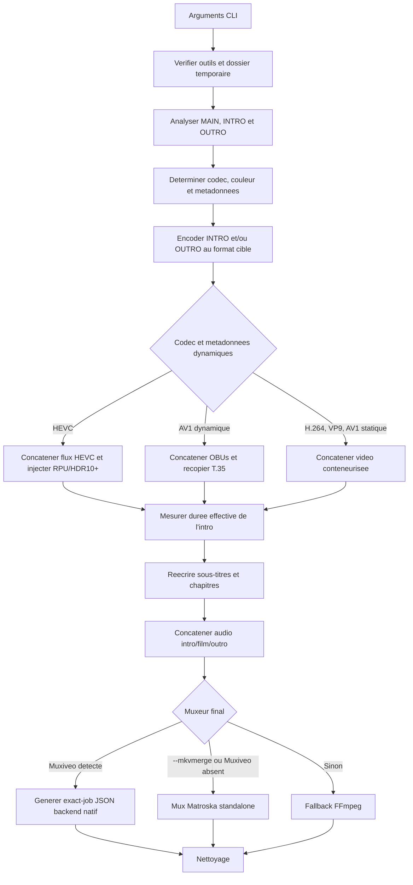
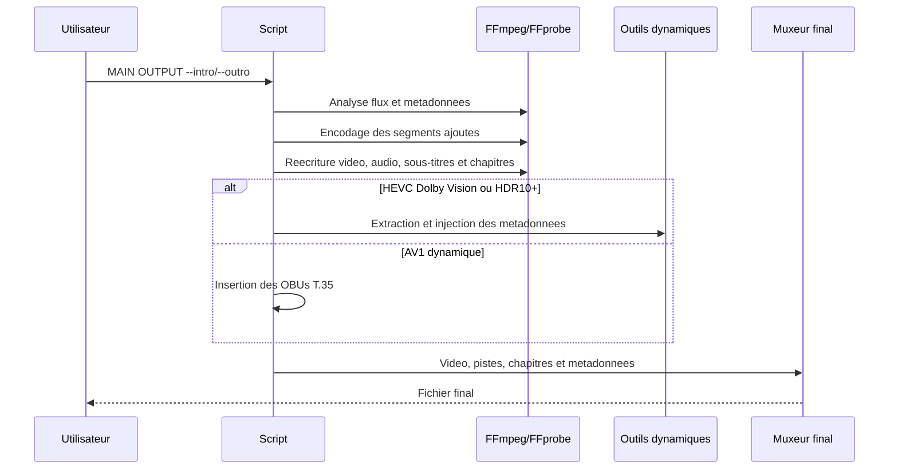

# `concat_video.py`

## Objectif

`concat_video.py` ajoute une intro, une outro, ou les deux a une video
principale. Il reencode uniquement les segments ajoutes pour les rendre
compatibles avec la video principale, puis reconstitue un fichier final avec
la video, les pistes audio (avec prise en charge de l'Atmos), les sous-titres, les chapitres et, lorsque cela
s'applique, les metadonnees HDR dynamiques.

L'ordre final est toujours :

```text
intro (optionnelle) -> video principale -> outro (optionnelle)
```

Le script est generaliste : HDR, Dolby Vision et HDR10+ sont des chemins
specialises actives seulement quand ils sont detectes sur la video principale.

## Utilisation fonctionnelle

### Syntaxe

```bash
python scripts/concat_video.py MAIN OUTPUT --intro INTRO [options]
python scripts/concat_video.py MAIN OUTPUT --outro OUTRO [options]
python scripts/concat_video.py MAIN OUTPUT --intro INTRO --outro OUTRO [options]
```

Exemples :

```bash
# Intro seule
python scripts/concat_video.py film.mkv resultat.mkv --intro intro.mp4

# Outro seule
python scripts/concat_video.py film.mkv resultat.mkv --outro outro.mp4

# Intro et outro, en conservant toute l'image avec bandes noires si necessaire
python scripts/concat_video.py film.mkv resultat.mkv \
  --intro intro.mp4 --outro outro.mp4 --mode pad
```

Options :

| Option | Effet |
| --- | --- |
| `--intro CHEMIN` | Video ajoutee avant le film. |
| `--outro CHEMIN` | Video ajoutee apres le film. |
| `-m crop` | Adapte le segment ajoute en remplissant l'image cible, avec recadrage. Valeur par defaut. |
| `-m pad` | Adapte le segment ajoute en conservant toute l'image, avec bandes noires. |
| `-w DOSSIER` | Dossier de travail temporaire. |
| `--mkvmerge` | Force `mkvmerge` pour le reassemblage standalone final, meme si `Muxiveo` est detecte. |

Au moins une des options `--intro` ou `--outro` est obligatoire.

### Compatibilite de ligne de commande

L'ancienne syntaxe suivante reste acceptee avec un avertissement :

```bash
python scripts/concat_video.py INTRO MAIN OUTPUT
```

Elle equivaut a `MAIN OUTPUT --intro INTRO`. La syntaxe explicite avec
`--intro` et `--outro` doit etre privilegiee.

## Comportement par piste

### Video

La video principale definit les caracteristiques cible : codec, resolution,
SAR/DAR, cadence, format de pixels et signalisation de couleur. L'intro et
l'outro sont reencodees dans ce format puis assemblees autour du film.

Codecs video acceptes pour la video principale :

| Codec source | Encodeur des segments | Assemblage |
| --- | --- | --- |
| H.264/AVC | `libx264` | Demuxeur concat FFmpeg dans un conteneur Matroska temporaire. |
| HEVC/H.265 | `libx265` | Flux HEVC Annex-B, necessaire aux outils Dolby Vision et HDR10+. |
| VP9 | `libvpx-vp9` | Demuxeur concat FFmpeg dans un conteneur Matroska temporaire. |
| AV1 | `libsvtav1` | Demuxeur concat FFmpeg, ou flux OBU pour les metadonnees dynamiques. |

Les segments sont encodes avec un GOP de 1 afin de pouvoir commencer et finir
proprement au point de raccord. Les encodeurs disposent de reglages rapides
adaptes a leur implementation (`ultrafast`, `realtime`/`cpu-used`, ou preset
SVT-AV1).

La cadence cible privilegie `avg_frame_rate`; `r_frame_rate` n'est utilisee
qu'en repli. Cela evite le faux taux de 1000 fps rapporte par certains MKV AV1.

### Adaptation geometrique

Les segments ajoutes ne sont jamais etires :

- `crop` calcule un recadrage centre, puis effectue la mise a l'echelle.
- `pad` effectue une mise a l'echelle proportionnelle, force des dimensions
  paires, puis ajoute des bandes noires centrees.
- Le SAR cible est reimpose avec `setsar`.

### Couleur, SDR et HDR statique

Le script reapplique aux segments les primaires, la fonction de transfert et
la matrice de la video principale quand FFmpeg les expose. Les metadonnees HDR
statiques disponibles (mastering display, MaxCLL, MaxFALL) sont egalement
repassees au muxeur final pour les sorties Matroska.

Le script ne fait ni conversion SDR vers HDR, ni tone mapping, ni conversion
HDR vers SDR. Il signale et conserve la colorimetrie declaree par la source;
la qualite visuelle depend donc aussi de la compatibilite du contenu ajoute
avec cette colorimetrie.

### Dolby Vision et HDR10+

Les metadonnees dynamiques sont prises en charge seulement pour HEVC et AV1.
Une source H.264 ou VP9 qui serait annoncee avec Dolby Vision ou HDR10+ est
refusee.

#### HEVC

1. Le flux principal est extrait en HEVC brut.
2. `dovi_tool` extrait le RPU Dolby Vision, si present.
3. `hdr10plus_tool` extrait le JSON HDR10+, si present.
4. La premiere metadonnee dynamique de la source est dupliquee pour chaque
   image de l'intro et de l'outro.
5. Le RPU ou le JSON ainsi reconstruit est injecte dans le flux HEVC final.

Les outils `dovi_tool` et `hdr10plus_tool` operent sur des flux HEVC. Ils ne
sont pas utilises pour AV1.

#### AV1

Dolby Vision Profile 10 et HDR10+ AV1 utilisent des OBUs Metadata ITU-T T.35.
Le script :

1. extrait la video AV1 en low-overhead OBU avec des Temporal Delimiter OBUs;
2. lit les tailles LEB128 et separe les unites temporelles;
3. prend les OBUs T.35 de la premiere image principale;
4. les insere dans chaque unite temporelle de l'intro et de l'outro;
5. reassemble les segments dans l'ordre final.

Cette voie exige un flux AV1 valide avec champs de taille et Temporal
Delimiter. En cas de flux incomplet, de compte d'images incoherent ou de T.35
absent, le traitement s'arrete avec une erreur plutot que de produire un
fichier ambigu.

## Audio

Chaque piste audio principale est traitee independamment. Les pistes
concatenees suivent l'ordre intro -> film -> outro. L'audio de l'intro ou de
l'outro est encode dans le codec, la frequence, le nombre de canaux et, quand
il est disponible, le debit de la piste principale.

Codecs cibles declares par le script : AAC, AC-3, E-AC-3, FLAC, Opus, MP3,
DTS et TrueHD.

Si l'audio d'un segment ajoute est absent ou ne peut pas etre encode, le
script essaie de creer un silence de meme duree et de meme configuration. Si
la piste ne peut toujours pas etre construite, la piste audio principale est
conservee avec son demarrage apres l'intro. Dans ce repli, elle ne couvre pas
l'outro ajoutee.

### DTS et TrueHD

DTS et TrueHD sont detectes et presentes dans la table des codecs, mais leur
concatenation depend de l'encodeur FFmpeg installe. Dans l'environnement de
reference, les encodeurs `dca` (DTS) et `truehd` sont experimentaux et
necessitent `-strict -2`; le script ne transmet pas cette option. De plus, le
nom d'encodeur DTS configure est `dts`, alors que FFmpeg expose generalement
`dca`. En pratique, ces pistes tombent donc souvent dans le repli de piste
decalee au lieu d'etre concatenees.

### Atmos

Une piste est consideree Atmos uniquement lorsque MediaInfo detecte un
marqueur de bitstream dans `Format_Commercial_IfAny`,
`Format_AdditionalFeatures`, `Format_Profile` ou `Format`. Les marqueurs
acceptes sont `Dolby Atmos`, `Joint Object Coding` et `JOC`. Le titre de la
piste n'intervient pas dans cette decision.

Pour une intro Atmos detectee, le script reserve 32 ms au debut de la piste,
extrait la premiere trame Atmos du film et la place avant l'audio d'intro.
Cette trame contient l'en-tete JOC necessaire a la reconnaissance Atmos par
certains lecteurs, notamment Plex et MediaInfo. Le reste de la piste du film
est ensuite ajoute apres l'audio d'intro.

## Sous-titres et chapitres

### Regle de temporalite

La duree de l'intro est mesuree sur le fichier encode temporaire avec
`ffprobe format=duration`, arrondie a la milliseconde. Elle ne provient donc
pas du calcul `nombre d'images / FPS`.

Les sous-titres et les chapitres sont materialises avec de nouveaux
timestamps. Le mux final ne leur applique pas de `--sync` ou de
`time_shift_ms`.

### Sous-titres

Chaque piste de sous-titres est remuxee temporairement apres recalcul de ses
timestamps. Les donnees de cue ne sont pas analysees ou modifiees manuellement
pour les codecs copies : le nouveau timestamp est porte par les paquets du
conteneur temporaire.

| Format source | Traitement | Resultat |
| --- | --- | --- |
| SRT/SubRip | Copie de flux dans MKV avec timestamps recalculees. | SRT conserve. |
| PGS | Copie de flux dans MKV avec timestamps recalculees. | PGS bitmap conserve. |
| MOV_TEXT | Conversion en SRT dans MKV avec timestamps recalculees. | Texte et timings conserves; style MOV_TEXT eventuellement perdu. |
| Autres codecs compatibles Matroska | Copie de flux dans MKV. | Codec conserve si FFmpeg et le muxeur l'acceptent. |

MOV_TEXT requiert une conversion dans ce workflow : Matroska ne peut pas le
copier comme codec de sous-titres, et un MP4 MOV_TEXT isole normalise le
premier timestamp a zero via ses edit lists. La conversion vers SRT permet de
porter un premier cue apres l'intro dans un conteneur MKV.

Les sous-titres originaux sont exclus du mux final. `Muxiveo` recoit une copie
de la source sans sous-titres, afin d'eviter qu'il reintroduise implicitement
une piste originale avec des timestamps non recalcules.

### Chapitres

Les chapitres de la source sont lus avec FFprobe, puis reconstruits avec :

```text
nouveau_timecode = timecode_source + duree_intro
```

Le script ne cree pas de chapitre automatique pour l'intro ni pour l'outro.

- Avec `mkvmerge`, un XML Matroska temporaire est genere avec les nouveaux
  `ChapterTimeStart`; les chapitres source sont exclus.
- Avec `Muxiveo`, le job `exact-job` utilise `chapters.add` avec les timecodes
  recalcules et desactive l'import automatique de la source.
- Avec le fallback FFmpeg, un fichier FFmetadata temporaire contient les
  chapitres recalculees et devient la source de chapitres du fichier final.

Cette reconstruction preserve les positions et les titres exposes par
FFprobe. Elle ne conserve pas necessairement les editions complexes, les
chapitres imbriques, les langues multiples ou les tags proprietaires Matroska.

## Pistes annexes et metadonnees de conteneur

Avec `mkvmerge`, le script conserve les pieces jointes et les pistes source
non remplacees. La video source est toujours exclue, de meme que les pistes
audio qui ont ete concatenees. Les pistes audio non concatenees sont la seule
famille de piste qui garde un decalage applique par muxeur.

Avec `Muxiveo`, un `exact-job` est genere avec la video recomposee, les pistes
audio concatenees, une source principale sans sous-titres, les sous-titres
re-ecrits et les chapitres reconstruits.

Sans `mkvmerge` et sans `Muxiveo`, le fallback FFmpeg conserve la video, les
pistes audio concatenees, les sous-titres re-ecrits et les chapitres
reconstruits. Il ne garantit pas la conservation des pieces jointes ni des
pistes audio non concatenees. La signalisation Dolby Vision au niveau du
conteneur peut aussi etre incomplete.

## Pre-requis et detection des outils

Outils de base obligatoires :

- `ffmpeg`
- `ffprobe`
- `mediainfo`

Outils conditionnels :

| Outil | Quand il est requis |
| --- | --- |
| `mkvmerge` | Standalone uniquement : force par `--mkvmerge`, ou repli quand `Muxiveo` est absent. |
| `dovi_tool` | Source HEVC avec Dolby Vision. |
| `hdr10plus_tool` | Source HEVC avec HDR10+. |
| `Muxiveo` | Detecte automatiquement; muxeur final privilegie quand il est disponible. |

Pour chaque outil, l'ordre de resolution est :

1. le chemin explicite defini dans les constantes `*_PATH`;
2. le `PATH` systeme;
3. l'executable `<racine-du-projet>/<nom>`;
4. le dossier `<racine-du-projet>/tools/<nom>`;
5. sous Windows, `<racine-du-projet>/tools/<nom>.exe`.

Les constantes sont en tete du script :

```python
FFMPEG_PATH = None
FFPROBE_PATH = None
DOVI_TOOL_PATH = None
HDR10PLUS_TOOL_PATH = None
MEDIAINFO_PATH = None
MKVMERGE_PATH = None
MUXIVEO_PATH = None
DEFAULT_WORKDIR = None
```

`Muxiveo` est detecte automatiquement; un chemin explicite `MUXIVEO_PATH`
reste prioritaire. Sans `--mkvmerge`, l'ordre de selection du muxeur final est
toujours `Muxiveo`, puis `mkvmerge`, puis le fallback FFmpeg.

Quand `Muxiveo` est retenu, le script lui transmet un `exact-job` avec
`mux_backend: native` et reutilise les chemins d'outils retournes par
`Muxiveo --cli tools` (FFmpeg, FFprobe, MediaInfo, dovi_tool,
hdr10plus_tool), plutot qu'une configuration parallele.

Le dossier temporaire est choisi dans cet ordre : `--workdir`,
`DEFAULT_WORKDIR`, dossier temporaire Windows, puis dossier de sortie sous
Linux/macOS. Le dossier doit disposer d'assez d'espace pour les copies de
flux, les sous-titres remuxes et les fichiers de metadonnees.

## Architecture logique





## Architecture technique detaillee

### Analyse media

`get_video_audio_metadata()` interroge FFprobe et complete, quand possible,
les informations via MediaInfo. La premiere piste video non attachee est la
piste de reference. Les images de couverture sont ignorees.

Les pistes audio et sous-titres sont inventoriees avec `mkvmerge -J` quand
celui-ci est utilisable, sinon avec FFprobe. MediaInfo complete les debits
audio lorsque possible.

### Preparation video

Les segments ajoutes sont encodes video seule (`-an`). Leur audio est traite
independamment piste par piste. Pour HEVC, le flux final est un flux brut
Annex-B. Pour AV1 dynamique, le flux final temporaire est un flux low-overhead
OBU. Pour les autres cas, le demuxeur concat de FFmpeg assemble des MKV
video-seuls compatibles.

### Reecriture des sous-titres

`prepare_shifted_subtitle_sources()` cree une source temporaire par piste de
sous-titres. FFmpeg applique la nouvelle base temporelle pendant ce remux.
Le fichier temporaire est ensuite une entree normale du muxeur final : il ne
recoit plus de regle de synchronisation supplementaire.

PGS est copie sans decodage ni OCR. SRT est copie sans reparsing manuel.
MOV_TEXT est decode puis encode en SRT pour contourner les limites MP4/MKV
decrites plus haut.

### Reecriture des chapitres

`get_chapters()` lit les debuts et fins avec FFprobe. Le script fabrique
ensuite soit un XML Matroska (`write_shifted_matroska_chapters()`), soit un
FFmetadata (`write_shifted_ffmetadata()`), soit des objets `chapters.add`
pour `Muxiveo`.

### Mux final

`Muxiveo` est privilegie des qu'il est detecte : le script prepare un job JSON
`exact-job` en `mux_backend: native` et l'execute via `--cli run`, avec les
chemins d'outils partages par `--cli tools`. `mkvmerge` reste la voie
standalone : il est force par `--mkvmerge` ou utilise en repli quand `Muxiveo`
est absent. Son code de retour `1` est accepte car il peut representer des
avertissements non fatals. Le fallback FFmpeg est moins complet mais maintient
les sous-titres et chapitres re-ecrits.

## Limitations et points d'attention

1. La sortie pratique est Matroska. Le script ne propose pas de branche MP4
   dediee; une extension `.mp4` n'implique pas la compatibilite de toutes les
   pistes avec MP4.
2. PGS est preserve dans le flux Matroska, mais ne serait pas une piste MP4
   standard. MOV_TEXT est converti en SRT dans ce workflow.
3. Les chapitres complexes Matroska ne sont pas preserves integralement lors
   de leur reconstruction depuis FFprobe.
4. Les pistes DTS et TrueHD peuvent ne pas etre concatenees si les encodeurs
   experimentaux correspondants ne sont pas actives dans FFmpeg.
5. Les pistes audio non concatenees gardent un decalage de muxeur; elles ne
   sont pas re-ecrites comme les sous-titres et chapitres.
6. La duplication de la premiere metadonnee dynamique Dolby Vision, HDR10+
   ou T.35 sur les segments ajoutes est une approximation. Elle ne constitue
   pas une analyse scene par scene de l'intro ou de l'outro.
7. Le script attend des frequences et des caracteristiques d'encodage
   compatibles. Les sources VFR, interlacees, multi-video ou avec une
   signalisation inhabituelle meritent une validation manuelle du resultat.
8. Le fallback FFmpeg peut perdre des pieces jointes et certaines metadonnees
   de conteneur. Pour des MKV complexes, utiliser `Muxiveo` ou `mkvmerge`.
9. La documentation de l'AppImage `Muxiveo` et les outils externes peuvent
   evoluer independamment; verifier leurs versions pour les flux Dolby Vision
   et HDR10+ critiques.

## Verification recommandee

Apres une execution, verifier au minimum :

```bash
# Flux, codecs, couleurs et duree
ffprobe -v error -show_streams -show_format resultat.mkv

# Positions des chapitres
ffprobe -v error -show_chapters -of json resultat.mkv

# Premier timestamp d'une piste de sous-titres
ffprobe -v error -select_streams s:0 -show_entries packet=pts_time \
  -of csv=p=0 resultat.mkv | head -n 1

# Contenu Matroska et identifiants de pistes
mkvmerge -J resultat.mkv
```

Pour une intro de `1000 ms`, le premier chapitre source et le premier cue de
sous-titre source doivent commencer a `1.000 s` dans le resultat.
